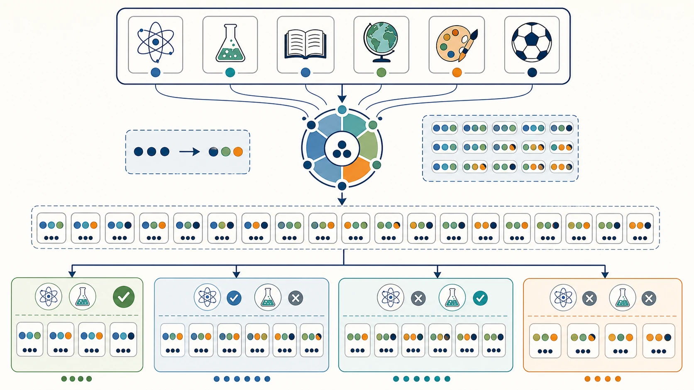

# 06 高中选科的20种组合完整分析

“物化生是不是学霸组合？”“物化地是不是比物化生轻松？”“政史地专业范围窄，是不是一定不能选？”

网上关于选科组合的文章很多，常见做法是给 20 种组合排一个“推荐榜”。这样的榜单看起来直接，却往往忽略三个最重要的变量：**你在哪个省份、想保留哪些专业、你本人能否把三门科目学好。**

同一个“物化地”，对物理稳定、化学上升、地理擅长的学生，可能结构合理；对三科都靠大量时间勉强维持的学生，就可能压力集中。组合名称相同，结论完全可以不同。

> **先说结论：** 20 种组合没有脱离个人和地区规则的统一排名。比较组合时，应同时看专业要求、三科学习方式、长期成绩、投入压力、赋分规则和学校开班条件。专业选择面广，不等于高考总分一定有优势；当前分数高，也不等于未来报考方向一定匹配。

> **适用范围提醒：** 本文主要解释常见“3+3”框架下，从物理、化学、生物学、思想政治、历史、地理六门中选三门所形成的 20 种组合。如果你所在省份采用“3+1+2”，理论上是 12 种组合，不能直接照搬本文的组合清单，但可以借鉴本文的比较维度。个别地区的具体科目范围和规则还可能不同，请先核对本省方案。

<!-- 图片描述说明：文章头图，20 种组合的比较框架图。画面中心是一张由六门选考科目图标构成的“六选三”组合盘，周围以 20 张小而等权的三科组合卡片形成环形矩阵；卡片只用物理、化学、生物学、思想政治、历史、地理的规范图标组合表示，不突出任何一张。外圈设置四个同等重要的判断维度：专业要求用大学与文件图标，学科实力用趋势图标，投入压力用时钟与任务清单图标，学校条件用校园与课表图标；四条连线共同指向“候选组合”而非“最佳组合”。画面应帮助读者理解组合需要多维比较，不出现前三名、皇冠、红黑榜、覆盖率百分比或唯一答案。 -->

## 一、20 种组合是怎样产生的？

在常见六选三框架中，从六门科目里任意选择三门，数学上共有 20 种组合。为了看清差异，可以按是否选择物理、化学分成四组。

| 组合类别 | 具体组合 | 数量 |
|---|---|---:|
| 同时选择物理和化学 | 物化生、物化政、物化史、物化地 | 4 |
| 选物理、不选化学 | 物生政、物生史、物生地、物政史、物政地、物史地 | 6 |
| 选化学、不选物理 | 化生政、化生史、化生地、化政史、化政地、化史地 | 6 |
| 物理和化学都不选 | 生政史、生政地、生史地、政史地 | 4 |

这四组不是优劣分层，而是机会结构不同。近年来，高校会根据专业培养需要提出选考科目要求；部分理工农医专业可能同时要求物理和化学，也有大量专业不提具体科目要求或提出其他要求。只有查询所在招生省份、适用年份、院校和具体专业，才能知道某个组合对你意味着什么。

<!-- 图片描述说明：六选三生成 20 种组合的结构示意图。顶部是物理、化学、生物学、思想政治、历史、地理六张等大的科目卡片，中间通过“每次选择三张”的组合盘形成 20 个同样大小的小组合单元；下方再按是否包含物理、化学分成四个并列分组区域，分别标示 4、6、6、4 个组合的数量关系。图只解释组合如何产生和如何分类，所有组合卡片视觉权重相同，不把任一组合画成更热门、更容易或更有价值。 -->

## 二、比较组合前，先统一六把尺子

### 1. 专业匹配：先看“想保留什么”，再看覆盖多少

不要只问“这个组合能报多少专业”，而要问：“我真正关心的 20 个专业里，能报几个？”一万个自己完全不考虑的专业，对个人决策没有实际价值。

### 2. 学科竞争力：三门单科能不能形成合力

组合不是把三门课名放在一起。要看每一科的相对排名、提升速度和错误类型，也要看三科是否同时处于高波动状态。

### 3. 学习方式：压力是集中还是互补

有的组合以模型、实验和计算为主；有的组合材料阅读和表达较多；有的跨越自然科学与人文社会。所谓“跨度大”不一定是缺点，关键是这种切换对你而言是调节，还是额外负担。

### 4. 时间投入：不能只看哪科“作业少”

记忆复现、计算训练、实验分析、材料阅读都需要时间。比较的是你本人达到稳定表现所需的时间，不是网上流传的平均作业量。

### 5. 赋分表现：看长期相对位置，不猜未来人群

等级赋分通常关注考生在同科目群体中的相对位置，具体办法由各省规定。“选的人少更容易赋高分”“高手多就一定吃亏”都不是可靠结论。未来考生结构也难以准确预测。

### 6. 学校条件：纸面可选，不等于本校一定开班

师资、选科人数、走班安排、课表冲突和调整政策，都会影响组合能否落地。提交前必须向学校核实。

## 三、第一组：同时选择物理和化学的4种组合

这四种组合共同保留物理和化学，常被考虑理工、材料、能源、生命医药等方向的家庭重点关注。它们的共同特点是：物化知识连续性和综合训练要求较高，第三科主要改变学习节奏和个人优势结构。

### 1. 物化生：自然科学关联较强

**学习结构：** 物理重模型与计算，化学重反应、实验与知识网络，生物学重生命机制、实验、图表和准确表达。三科都与自然科学探究有关，但学习方式并不相同。

**主要优势：** 如果学生对生命科学、医疗健康、基础科学或工程技术方向都有兴趣，这一组合便于保持较连续的科学学习语境；物化能够满足部分专业的选考要求，生物学也能帮助学生提前认识生命系统。

**潜在风险：** 不能把“学科关联强”误解为“一门学好，另外两门自然轻松”。三科知识量、实验分析和综合训练都需要持续投入，高二后压力可能同时上升。

**更适合：** 物理和化学至少有一门稳定优势，另一门问题可改；生物学不是只靠临考背诵；对自然科学有持续兴趣。

**慎选信号：** 三科都处于高投入、低提升；只是因为“传统理科组合”或同学多而跟随；想学医学却从未查过具体院校要求。

### 2. 物化政：科学推理与社会材料切换

**学习结构：** 物化承担模型、计算、实验和规律训练，思想政治侧重理论框架、现实材料和规范表达。三科之间知识直接重合较少，思维任务差异明显。

**主要优势：** 政治可以为学习节奏提供不同类型的任务；对理工方向感兴趣、同时关心法律、公共事务、社会治理或部分特殊招生的学生，可以保留更跨领域的探索空间。

**潜在风险：** 切换成本可能较高。物化需要持续练习和理解，政治需要框架复现、材料阅读和主观题表达，不能把政治当成“考前背一背”的调节科目。

**更适合：** 物化基础较稳，阅读与表达不弱，愿意关注现实并整理理论；不排斥自然科学和人文社会两种思维方式。

**慎选信号：** 政治只是临时替代科目；长材料和主观表达长期薄弱；三科复习节奏难以协调。

### 3. 物化史：理工基础与历史论证并行

**学习结构：** 物化强调科学模型与实验规律，历史强调时空框架、史料证据和解释论证。这是跨度较明显的组合。

**主要优势：** 适合自然科学基础较好、同时真正擅长历史阅读和论证的学生；三科任务差异大，对部分学生而言可以形成思维调节。

**潜在风险：** 知识协同性有限，历史的时间线、材料与论述训练需要独立投入。不能因为“历史当前分高”就忽略其高二后的材料难度。

**更适合：** 物化能稳定推进，历史相对排名也稳定；愿意在计算实验之外投入时间阅读、整理和写作。

**慎选信号：** 只是喜欢历史故事，不愿处理史料；物化本身已占用大量时间；选择历史只是为了回避其他再选科目。

### 4. 物化地：理工基础与空间综合结合

**学习结构：** 物化重科学模型、反应与实验，地理兼有自然过程、图表、区域与人文综合。地理中的图像和自然过程与理科思维有一定相通，但主观表达同样重要。

**主要优势：** 对于擅长图表、空间分析和因果链的学生，三科思维衔接可能较自然；专业探索可以同时关注理工、资源环境、地球科学和区域研究等方向。

**潜在风险：** “地理偏理科”不等于地理轻松。自然地理需要理解，人文与区域综合题需要材料分析和规范表达。物化地也可能形成较高的综合训练量。

**更适合：** 物化基础稳定，地理读图和综合题表现较好；喜欢从自然过程和区域条件解释问题。

**慎选信号：** 只是听说地理好赋分；空间想象、读图和综合表达长期困难；三科均依赖大量刷题维持。

## 四、第二组：选物理、不选化学的6种组合

这组组合保留物理，却不选择化学。它可能保留部分重视物理的专业方向，但如果某专业明确要求“物理和化学均须选考”，仍会失去报考资格。因此，不能用“不选化学也有物理”推断所有理工专业都能报。

### 5. 物生政：物理、生命与社会议题并存

**学习结构：** 物理重建模计算，生物学重概念实验，政治重理论材料。三科任务多样，直接知识关联不强。

**主要优势：** 适合物理有优势、同时对生命健康和公共社会议题都感兴趣的学生；任务类型多样，可能缓解连续计算或连续材料学习的疲劳。

**潜在风险：** 不选化学可能影响部分生命医学和理工专业；生物与政治都需要准确表达，不能简单归为“背诵科目”。

**更适合：** 物理稳定，生物和政治至少有一门明显优势；能够在模型、实验和材料间切换。

**慎选信号：** 想学的专业普遍要求化学，却没有核验；选择生物和政治只因为当前卷面分高。

### 6. 物生史：科学模型、生命机制与历史解释

**学习结构：** 物理和生物学属于自然科学学习，但任务差别明显；历史增加时空、史料和论证要求。

**主要优势：** 适合物理基础较好，同时在人文阅读和生命科学中都有兴趣的学生；组合能体现跨领域能力。

**潜在风险：** 三科知识网络相对独立，复习材料较分散；不选化学会影响部分理工农医方向。

**更适合：** 三科均有连续表现证据，历史不是单靠记忆，生物也能处理实验和遗传推理。

**慎选信号：** 专业方向偏材料、化工、医药却回避化学；历史与生物都靠考前突击。

### 7. 物生地：自然科学与图表分析较集中

**学习结构：** 物理的模型、生物的实验图表、地理的空间过程，都要求从图文材料中提取信息。计算、概念和综合表达并存。

**主要优势：** 对图表、自然现象、生命与环境议题有兴趣的学生，可能在信息分析上形成协同；复习任务比纯人文学科组合更多样。

**潜在风险：** 不选化学可能缩小部分理工农医方向；三科都可能出现长材料和综合题，所谓“少背”并不成立。

**更适合：** 物理较稳，生物和地理的图表材料题表现良好，愿意进行跨学科综合分析。

**慎选信号：** 只是用生物、地理替代化学；专业核验显示目标方向要求物化；综合表达长期薄弱。

### 8. 物政史：物理与两门人文社会科目组合

**学习结构：** 物理提供模型计算训练，政治与历史集中在材料阅读、理论框架、时空解释和主观表达。

**主要优势：** 适合物理单科明显有优势、同时人文阅读表达更强的学生；可以保留部分重视物理的方向，同时发展人文社会兴趣。

**潜在风险：** 学习方式切换大；不选化学、生物学可能影响部分自然科学和医学健康方向。政治与历史的材料和表达训练量不能低估。

**更适合：** 物理稳定且无需过度投入，政治历史有真实相对优势，未来方向仍保持跨领域探索。

**慎选信号：** 用两门人文学科“托住”物理，却没有任何目标方向和成绩证据；三科总投入过高。

### 9. 物政地：模型、社会理论与区域综合

**学习结构：** 物理重模型，政治重理论材料，地理重空间与区域因果。这三门分别代表不同的分析视角。

**主要优势：** 适合思维切换能力较好、物理和地理图表能力较强、同时能处理政治材料的学生；可探索理工、资源环境和部分社会科学方向。

**潜在风险：** 知识协同有限，三科都需要独立建立框架；不选化学可能影响部分物化同选专业。

**更适合：** 物理是稳定优势，政治和地理至少一门是成长优势；对公共事务、环境与技术交叉议题有兴趣。

**慎选信号：** 把政治或地理当“容易科目”；主观题表达长期不稳定；目标理工专业需要物化。

### 10. 物史地：模型与人文地理相结合

**学习结构：** 物理重抽象模型和计算，历史与地理都涉及材料、时空和区域，但历史重史料解释，地理重空间过程与人地关系。

**主要优势：** 历史和地理在时空意识、区域背景上有一定联系；适合物理有优势，又擅长人文材料和空间分析的学生。

**潜在风险：** 历史地理并非可以用同一套模板学习；不选化学可能限制部分理工方向。三科跨度仍然明显。

**更适合：** 物理相对排名稳定，历史地理都能从材料中建立因果，不依赖死记模板。

**慎选信号：** 因为不喜欢政治、生物就被动留下历史地理；目标专业要求化学；长材料阅读和表达吃力。

## 五、第三组：选化学、不选物理的6种组合

这组组合保留化学，但不选择物理。对化学、材料、生命、食品、环境等方向感兴趣的学生，化学知识可能具有价值；但在具体报考中，许多专业可能同时提出物理要求，所以“选了化学”并不能自动保留相关资格。

### 11. 化生政：生命化学与社会材料结合

**学习结构：** 化学与生物学在物质、生命和实验方面有一定联系，政治提供社会理论、材料分析和表达任务。

**主要优势：** 适合对生命健康、药学、食品、社会公共议题感兴趣的学生；化生之间可形成部分知识联想，政治调节任务类型。

**潜在风险：** 不选物理可能影响部分理工农医专业；化生的实验和概念量不小，政治也不能只靠突击。

**更适合：** 化学和生物学表现稳定，政治材料分析不弱；目标专业经过核验后不要求物理。

**慎选信号：** 只根据“想学医”选择化生，未查具体要求；三科都依赖大量记忆且复习机制薄弱。

### 12. 化生史：生命科学与历史材料并行

**学习结构：** 化生有一定自然科学关联，历史需要独立的时空框架和史料论证。

**主要优势：** 适合化生基础较好、同时历史相对优势明显的学生；学习任务在实验推理和人文阅读之间切换。

**潜在风险：** 不选物理可能减少部分理工农医选择；历史与化生知识直接关联有限，复习体系较分散。

**更适合：** 化生不是靠短期背诵，历史材料题和论述题表现稳定；目标方向核验后可接受。

**慎选信号：** 只是因为物理当前低分就立即放弃；想报专业普遍要求物化；历史只有故事兴趣。

### 13. 化生地：生命、环境与区域问题联系较多

**学习结构：** 化学、生物学、地理都能触及资源、环境、生命和地球系统，但三科仍有各自的实验、概念和空间分析要求。

**主要优势：** 对环境、生态、食品、生命和区域可持续发展感兴趣的学生，知识语境较协调；图表和材料分析在三科中都较常见。

**潜在风险：** 不选物理可能影响部分材料、环境和生命相关专业；三科知识量和综合题训练并不轻。

**更适合：** 化生稳定，地理读图和因果表达较强；喜欢从物质、生命和环境多个层面分析问题。

**慎选信号：** 把三科都理解为“记忆型”；目标专业实际要求物化；实验与图表能力都不稳定。

### 14. 化政史：化学与两门人文社会科目

**学习结构：** 化学负责反应、实验和计算，政治历史集中在材料、理论、时空和论证。

**主要优势：** 适合化学单科较强、同时人文社会科目更有优势的学生；能保留一定科学学习基础和较广的人文兴趣。

**潜在风险：** 不选物理、生物学可能限制部分自然科学和医药方向；化学与政史之间知识联动较少，任务切换大。

**更适合：** 化学是明确稳定优势，政治历史阅读表达好；未来方向偏人文社会或经核验不要求物理。

**慎选信号：** 保留化学只是“舍不得当前高分”，但未来方向和学习投入都不匹配。

### 15. 化政地：物质规律、社会理论与区域分析

**学习结构：** 化学重微观和实验，政治重制度与材料，地理重空间和人地关系。跨学科明显。

**主要优势：** 适合化学有优势、政治地理中至少一门表现稳定的学生；可以探索环境、资源、社会治理等交叉议题。

**潜在风险：** 三科框架独立，需要较强的时间管理；不选物理会影响部分理工方向。

**更适合：** 能在化学实验计算与两门材料型科目间顺畅切换；目标专业要求已核验。

**慎选信号：** 三科都波动大；政治和地理只是“听说容易赋分”；仍希望大范围保留工科却不查物理要求。

### 16. 化史地：化学与时空区域学习结合

**学习结构：** 化学提供自然科学实验和反应体系，历史地理都涉及时空，但一个重史料解释，一个重区域过程。

**主要优势：** 适合化学单科优势明显，并在历史地理材料阅读中表现较好的学生；任务有一定互补。

**潜在风险：** 组合知识关联度有限；不选物理可能限制部分理工方向，历史地理也都有较高的综合表达要求。

**更适合：** 化学稳定，历史地理相对位置清楚；未来偏人文、地理环境或其他经核验方向。

**慎选信号：** 只是从四门低分科里“凑三门”；专业调查尚未开始；三科复习体系都不完整。

## 六、第四组：物理和化学都不选的4种组合

物理和化学都不选，通常会减少部分理工农医专业的报考资格，但不等于“没有大学可上”或“只能走一条路”。人文社科、语言、教育、管理、艺术等许多方向中，可能存在不提科目要求或提出其他要求的专业。具体空间仍然必须通过官方目录确认。

### 17. 生政史：生命概念与两门社会人文学科

**学习结构：** 生物学包含概念、实验与图表，政治历史集中于材料阅读、理论解释和文字表达。

**主要优势：** 适合生物学有稳定优势，同时政治历史阅读表达较强的学生；可关注生命社会议题、人文教育和公共事务等方向。

**潜在风险：** 物化均不选，会影响部分自然科学、工程和医药专业；三科都可能需要大量概念复现与材料表达，时间压力并不一定低。

**更适合：** 明确不以物化要求较强的方向为主要目标，三科均有长期表现证据。

**慎选信号：** 因为“怕计算”而仓促回避物化，却未核验专业；生物学实验和遗传推理同样薄弱。

### 18. 生政地：生命、社会与区域综合

**学习结构：** 生物学、政治、地理都常出现材料和图表，但分别要求生命机制、社会理论和空间因果。

**主要优势：** 适合信息提取、图表阅读和综合表达较好的学生；对生态环境、公共事务、健康与区域发展有兴趣时，学习主题有一定交叉。

**潜在风险：** 物化均不选会缩小部分理工农医方向；三科不是“纯背诵”，综合题和概念准确性要求较高。

**更适合：** 三科相对排名稳定，擅长图文材料，专业方向核验后可接受。

**慎选信号：** 只因听说这三科赋分友好；目标专业要求物化；主观表达和概念辨析都不稳定。

### 19. 生史地：生命科学与时空区域结合

**学习结构：** 生物学侧重生命系统，历史地理共享一定的时空意识，但考试任务各有区别。

**主要优势：** 适合生物学稳定、历史地理材料能力较强的学生；可在生命、生态、文化和区域问题间保持广泛兴趣。

**潜在风险：** 物化均不选影响部分理工农医方向；历史地理一起选择不代表复习可以合并，三科仍需独立框架。

**更适合：** 喜欢生命与人文地理，三科都有真实成绩和投入证据；未来方向不依赖物化资格。

**慎选信号：** 把历史地理都当成背诵，把生物当成容易得分；没有长周期记录。

### 20. 政史地：人文社会分析较集中

**学习结构：** 政治重理论和现实材料，历史重时空与史料，地理重区域、人地关系与图表。三科都需要阅读和表达，但思维对象不同。

**主要优势：** 适合人文社会兴趣稳定、材料阅读和文字表达较强的学生；政治、历史、地理在社会发展、区域和公共议题上可以形成一定联系。

**潜在风险：** 物理、化学、生物学均不选，会明显改变自然科学和部分理工农医方向的报考空间；三科记忆、材料和主观表达训练量大，绝不是“轻松组合”。

**更适合：** 对人文社科方向有较清楚认识，政史地相对排名和表达能力稳定，已核验目标专业要求。

**慎选信号：** 只是因为不擅长计算而被动选择；对三科核心任务也缺乏兴趣；家长和学生从未调查专业。

## 七、怎样从20种组合缩小到2—3个候选？

一次比较 20 种组合，很容易陷入信息过载。更有效的方法是逐层筛选。

### 第一步：建立专业底线

列出 3—5 个“很想保留”的专业大类，再选若干具体院校专业作样本。按招生省份和适用年份核验选考要求，把明确不满足底线的组合先标出来。

这里的关键词是“标出来”，不是立即删除。如果学生的学科表现与专业底线严重冲突，还需要进一步调查相近专业和替代路径。

### 第二步：找出1—2门稳定科目

用最近 5 次测评或 8—12 周记录，找出相对排名稳定、投入合理、错因可改的科目。不要急着一次定满三门。

### 第三步：补出2—3个完整组合

围绕稳定科目，形成 2—3 个候选。例如：

- A 组合：专业匹配最好，但学习压力偏高；
- B 组合：成绩最稳，但减少一个探索方向；
- C 组合：目前处于成长状态，需要再观察八周。

### 第四步：比较风险，而不只比较优点

每个组合都要写出至少两项风险：哪一科可能拖累？哪个目标专业可能受限？学校是否开班？哪种压力可能在高二放大？

### 第五步：回到学校条件

向班主任或教务部门确认：候选组合是否开设、如何走班、何时确认、是否允许调整、调整后课程怎样衔接。

可以使用[候选组合评分表](../09-实用工具与附录/03-候选组合评分表.md)记录比较，但不要把总分最高机械理解为唯一答案。

<!-- 图片描述说明：候选组合的漏斗筛选流程图。左侧入口是一组等权排列的 20 张三科组合卡片，依次进入四层清晰的筛选关卡：第一层为“专业底线”，用高校专业目录和准入对勾图标表示先核对要求；第二层为“稳定科目”，用多次趋势线和波动标记表示看连续表现；第三层为“学习投入”，用时钟、错题本和精力刻度表示评估长期负荷；第四层为“学校条件”，用走班课表、师资与班级图标表示核对现实可行性。漏斗出口保留两到三张并列的候选卡，连接到“带着依据确认”的指南针图标；明确呈现逐层缩小范围的过程，不出现冠军、唯一最优组合或机械总分结论。 -->

## 八、一个组合比较案例：没有满分答案，只有可解释取舍

小禾物理排名稳定，化学经过补基础后正在上升，地理分数较高但综合题波动，生物学兴趣不错。她对计算机、环境和经济管理都有兴趣，所在地区采用常见“3+3”框架。

她留下三个候选：物化生、物化地、物生地。

| 比较项 | 物化生 | 物化地 | 物生地 |
|---|---|---|---|
| 专业核验 | 需要逐项确认目标专业 | 需要逐项确认目标专业 | 特别核查不选化学的影响 |
| 当前优势 | 物理稳定，生物兴趣较好 | 物理稳定，地理分数较高 | 物理稳定，生地较均衡 |
| 主要风险 | 化学和生物知识量并行 | 化学上升能否持续、地理波动 | 部分目标方向可能要求化学 |
| 下一步证据 | 观察生物简答与化学趋势 | 修复地理综合题，继续观察化学 | 核对计算机、环境方向要求 |

这个表没有自动给出答案。它的价值在于告诉小禾：下一步不需要继续刷“组合排行榜”，而要补三类信息——化学趋势、地理主观题稳定性、目标院校专业要求。

## 九、关于20种组合，最容易相信的五个误区

### 误区一：“物化生是学霸组合”

组合不能决定学生身份。三科适配、投入合理，它才可能成为优势；三科都高投入低提升，同样会带来压力。

### 误区二：“文理搭配一定更轻松”

任务切换可能形成调节，也可能增加复习体系和时间管理成本。要看个人能力结构。

### 误区三：“专业覆盖广就是最好”

资格范围只是底线。总分竞争力、专业兴趣和未来学习能力同样重要。

### 误区四：“选科人数少就更好赋分”

赋分看本省规则和相对位置。人数、考生结构、试卷表现之间并不存在可以靠传言预测的简单关系。

### 误区五：“学校能开，就说明适合我”

开班只说明教学条件允许，不说明你的成绩、兴趣和专业方向匹配。

## 十、最终行动清单

- [ ] 确认所在省份是否属于本文所说的常见“3+3”六选三框架。
- [ ] 列出最想保留的专业方向，按省份、年份、院校和专业核验要求。
- [ ] 用学科记录找出 1—2 门稳定科目，而不是直接挑完整组合。
- [ ] 从 20 种组合中保留 2—3 个候选，并为每个组合写出至少两项风险。
- [ ] 向学校核实开班、走班、确认和调整政策。
- [ ] 使用[候选组合评分表](../09-实用工具与附录/03-候选组合评分表.md)完成一次家庭证据会。

在 20 种组合中，“物理+化学”常被单独讨论。它为什么在很多理工方向中受到重视，又会带来什么真实成本？请继续阅读：[“物理+化学”为什么成为重要组合？](07-物理加化学为什么成为重要组合.md)。

## 重要提示与参考

本文更新于 2026 年 8 月。20 种组合仅对应常见的六选三数学组合，不代表全国所有地区的实际可选方案。高校专业选考科目要求可能随适用年份、院校培养方案和招生省份变化；已公布的拟选科要求也不等于该专业当年一定在本省投放招生计划。最终请以本省教育考试机构、学校和高校当年正式信息为准。

- [教育部：新高考带来哪些新变化](https://www.moe.gov.cn/jyb_xwfb/s5147/202109/t20210914_562841.html)
- [教育部：七省份公布“3+1+2”高考改革实施方案](https://www.moe.gov.cn/jyb_xwfb/s5147/202109/t20210916_563605.html)
- [阳光高考：2027年各省市普通高校本科专业选考科目要求汇总](https://gaokao.chsi.com.cn/gkxx/ss/202502/20250225/2293354644.html)
- [上海市教育考试院：关于公布2027年普通高校本科专业选考科目要求的通知](https://gaokao.chsi.com.cn/gkxx/zc/ss/202502/20250225/2293372114.html)
