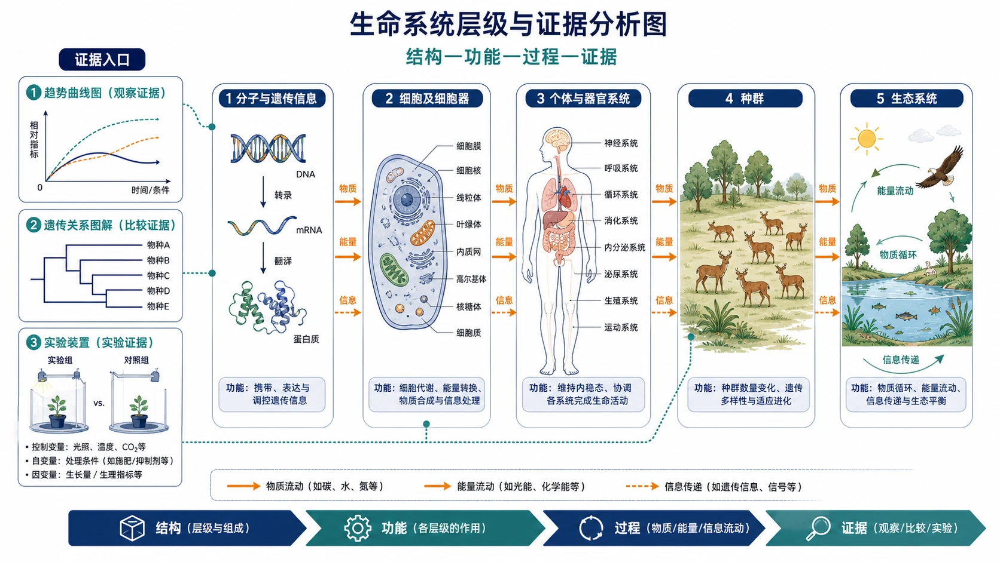
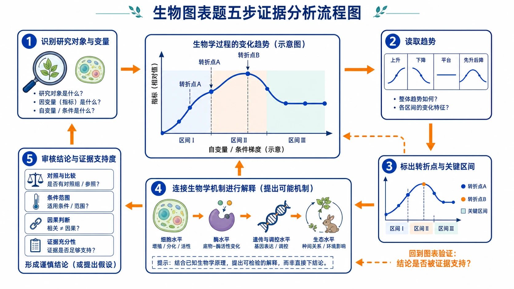
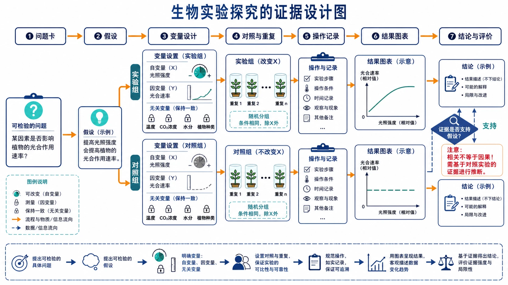

# 11 生物学学科学习解读

“生物学是不是记忆力好就能拿高分？”

“课本都背熟了，为什么选择题还是两个选项分不清？”

“喜欢动物、医学和健康，是不是说明适合选生物？”

生物学的确有大量概念和术语，但真正拉开差异的，往往不是背过多少，而是能否看清概念的条件和范围，能否从图表与实验中提取证据，再用准确语言解释生命过程。

> **先说结论：** 生物学不是“纯记忆科目”。它要求学生在生命系统不同层次间建立联系，准确区分概念边界，完成遗传推理、图表阅读、实验设计和规范表达。判断是否适合选生物学，不能只看兴趣或当前高分，还要看材料题和简答题表现、改错效率、长期复习习惯及专业要求。

<!-- 图片描述说明：文章头图，生命系统层级与证据分析图。画面从左到右或由内向外清楚展开五个层级：分子与遗传信息、细胞及细胞器、个体与器官系统、种群、生态系统；各层级用准确但简化的结构图连接，箭头表示物质、能量或信息在层级间的联系。旁侧设置三种证据入口：无真实数据的趋势曲线图、遗传关系图解、含对照组提示的实验装置，分别以细线连向相应层级。整体为白底生物教材图，强调“结构—功能—过程—证据”，不使用可爱化卡通生物、血腥医学画面或只罗列术语的装饰图。 -->

## 一、生物学研究的不是一堆名词，而是生命系统

高中生物学可以按生命系统层次理解。

| 层次 | 常见内容 | 核心问题 |
|---|---|---|
| 分子与细胞 | 物质组成、细胞结构、物质运输、能量转换 | 结构如何支持生命活动 |
| 个体稳态 | 内环境、神经、体液、免疫调节 | 系统怎样通过反馈保持稳定 |
| 遗传与进化 | 遗传规律、基因表达、变异、进化 | 信息怎样传递、改变和积累 |
| 种群与生态 | 种群、群落、生态系统、人类活动 | 生物与环境怎样相互作用 |
| 技术与实验 | 探究实验、生物技术、数据处理 | 怎样用证据检验生命科学问题 |

这些内容不是彼此孤立的。细胞代谢影响个体生命活动，遗传信息影响性状，个体又处在种群和生态系统中。学科难度就在于：同一个问题可能跨越多个层次。

## 二、初高中生物学习方式有哪些变化？

### 1. 从记事实走向理解机制

不仅要知道“发生什么”，还要解释过程、条件和因果。例如某激素变化后，相关器官、反馈环节和生理结果怎样联动。

### 2. 从熟悉图示走向陌生材料

试题会提供新实验、新技术或陌生生物现象。学生需要把材料中的变量、趋势和结果，与教材概念连接起来。

### 3. 从背答案走向规范表达

简答题常要求说清对象、条件、方向和结果。“促进”“增加”“有利于”等词如果缺少对象和原因，表达就不完整。

### 4. 从定性理解走向必要的定量推理

遗传概率、种群变化、实验数据和曲线分析都可能涉及数量关系。计算量未必很大，但逻辑链不能断。

## 三、概念边界：为什么“看起来都懂”仍会错？

生物学选择题常把两个熟悉概念放在一起，差别藏在条件、范围或因果关系里。

学习一个概念时，可以固定写五项：

1. **定义：** 它究竟指什么；
2. **对象：** 发生在哪个结构或层次；
3. **条件：** 在什么情况下成立；
4. **作用或结果：** 直接造成什么变化；
5. **易混点：** 与相近概念差在哪里。

例如“运输”“扩散”“主动运输”不能只背名称，要比较运输对象、方向、是否需要能量及相关结构。比较表比重复抄定义更有效。

判断选项时，圈出“都、只、一定、直接、主要”等限定词。很多错误并非整句话全错，而是范围被悄悄扩大。

## 四、图表材料题：先读数据，再调用知识

学生容易一看到熟悉主题就立刻套教材结论，忽略题目给出的新信息。更稳的顺序是：

### 第一步：确认图表对象

横轴、纵轴、单位、组别和实验条件分别是什么？曲线代表谁？

### 第二步：只描述可见趋势

先说增加、下降、平台、峰值或组间差异，不急着解释原因。

### 第三步：找变化节点

拐点、交叉点和异常值常对应条件变化或调节机制。

### 第四步：结合教材机制解释

用结构、功能、酶、能量、调节、遗传或生态关系解释趋势，并回到材料条件。

### 第五步：区分相关与因果

两个变量一起变化，不自动证明一个导致另一个。实验设计和材料信息必须足以支持因果结论。

<!-- 图片描述说明：生物图表题五步证据分析流程图。以一张无真实考试数据的曲线图为主视觉，周围依次环绕五个分析节点：先用放大镜识别研究对象与变量，再读取上升/下降/平台等趋势，再标出转折点和关键区间，然后用细胞、酶、遗传或生态过程的机制图标连接解释，最后用对照、条件范围和因果判断清单审核结论。五节点以箭头串联，末端回到曲线验证“结论是否被证据支持”。采用清晰的白底教材图表风格，曲线和节点只作示意，不给出真实分数、具体实验结论或把相关性直接画成因果。 -->

## 五、实验探究题：围绕一个清楚的问题设计证据

实验题可以用“目的—假设—变量—对照—操作—结果—结论”分析。

### 1. 目的和假设

目的要说明研究哪个因素对哪个结果的影响。假设必须能够通过结果被支持或否定。

### 2. 自变量、因变量和无关变量

- 自变量是主动改变的因素；
- 因变量是观察或测量的结果；
- 无关变量也会影响结果，需要保持适宜且一致。

### 3. 对照和重复

对照帮助排除其他解释，重复用于降低偶然性。对照组不是“什么都不做”，而是除自变量外尽量保持一致。

### 4. 结果和结论

结果是观察到的数据或现象，结论是根据结果对问题作出的回答。不能把预期结论写成实验结果，也不能超出数据范围。

### 5. 实验评价

检查样本量、测量方法、变量控制、对照设置和结果指标是否合理。提出改进时要明确改哪一步、解决什么问题。

<!-- 图片描述说明：生物实验探究的证据设计图。以一个可检验的问题卡为起点，依次连接假设、自变量/因变量、对照与重复、操作记录、结果图表、结论与评价六个模块；自变量用可改变的旋钮表示，因变量用测量尺和曲线表示，无关变量用保持一致的锁定符号表示，对照组与实验组用两条并行流程对照。结果与结论之间放置“证据是否支持”的审核标记，强调相关不等于因果。使用准确、克制的生物实验教材风格，不呈现真实学生数据、不伪造实验结论。 -->

## 六、遗传题：不是背比例，而是追踪信息

遗传题的核心是明确基因、染色体、配子、个体和后代之间的关系。

稳定流程可以是：

1. 明确性状和基因符号；
2. 根据亲子表现推断可能基因型；
3. 写出配子种类与概率；
4. 选择棋盘法、分支法或乘法原理；
5. 检查性别、伴性、致死或环境等附加条件；
6. 用题目要求的对象表达结果。

比例只是推理结果，不是起点。题目条件一变，机械套用固定比例就会失效。

## 七、稳态与调节：画出“刺激—感受—调节—反应—反馈”

神经、体液和免疫调节信息密集，适合用流程图整理：

**变化或刺激 → 感受与传递 → 调节中枢或调节物质 → 靶结构反应 → 指标变化 → 反馈。**

每个箭头都要说明方向和对象。回答“某激素增加”时，还要说明由谁分泌、作用于谁、最终使什么指标怎样变化。

## 八、生态题：先确定层次，再解释关系

生态问题常涉及个体、种群、群落和生态系统。层次不同，使用的概念也不同。

- 种群题关注数量、密度、年龄结构和增长；
- 群落题关注物种关系、演替和丰富度；
- 生态系统题关注能量流动、物质循环和信息传递；
- 环境治理题还要考虑人类活动、恢复力和可持续性。

不要把能量“循环”和物质“单向流动”混淆。作答前先写研究层次，能减少概念错位。

## 九、简答题：怎样把“我懂”变成得分表达？

生物学简答建议使用“对象＋变化＋机制＋结果”的因果链。

例如不只写“光合作用增强”，而要根据题意说明哪个条件改变、影响哪个过程或限制因素，最终使什么物质或速率发生怎样变化。

答题时注意：

- 使用教材中的规范术语；
- 对准设问动词，是说明、解释、预测还是评价；
- 材料给出的对象要在答案中出现；
- 不用模糊的“它”“这个”“有影响”；
- 一问多点时分层表达。

“意思差不多”在日常交流中可以，在学科表达中可能缺少对象和逻辑。

## 十、生物学常见失分的六类诊断

| 错因 | 典型表现 | 改进动作 |
|---|---|---|
| 概念边界 | 两个选项都觉得对 | 制作定义、条件、反例比较表 |
| 层次错位 | 把细胞、个体、种群概念混用 | 每题先标研究层次 |
| 材料漏读 | 直接套教材，忽略新条件 | 先圈变量、数据和限制词 |
| 实验逻辑 | 自变量、对照或结论混乱 | 用七步实验链重做 |
| 遗传推理 | 只记固定比例 | 写基因型、配子和条件链 |
| 表达不全 | 有关键词但因果缺环 | 使用“对象＋机制＋结果” |

如果主要失分来自术语和表达，针对性训练后通常可以验证改善；如果概念、实验、遗传和材料等多类问题长期同时存在，则要评估基础和投入。

## 十一、怎样安排高中三年的生物学习？

### 高一：建立概念卡和结构图

不要只在课本上画线。每个核心概念写清对象、条件、作用和易混点，把细胞过程画成结构或流程。

### 高二：加强遗传、调节和实验推理

知识关系变复杂后，要反复训练图文转换、概率链和反馈流程。实验题每次都完整标变量和结论范围。

### 高三：按题目任务整合知识

把图表、实验、遗传、调节、生态和表达作为方法模块复习，训练陌生材料中的迁移。回归教材是核对概念，不是只背整段文字。

## 十二、什么样的学生更可能适合选生物学？

### 适配信号

- 对生命、健康、遗传、生态有持续兴趣；
- 能耐心区分概念细节和条件；
- 愿意阅读图表、长材料并寻找证据；
- 能接受实验设计、遗传推理和规范表达；
- 复习后同类概念错误明显减少；
- 学习投入和相对排名比较稳定。

### 慎选信号

- 选择理由只有“好背”“分数看起来高”；
- 长期拒绝整理相近概念，只在考前突击；
- 实验、遗传和材料题都高投入低提升；
- 喜欢动物或医学名称，却排斥学科核心任务；
- 没有核验目标医学、生命专业对物理和化学的要求。

## 十三、一个案例：选择题不错，简答题为什么总失分？

示例学生小芮生物选择题相对稳定，简答题却常出现“写了很多、得分不高”。复盘发现，她答案里有教材关键词，但经常缺研究对象、条件和结果。

她把每道简答题改成三步：圈设问动词；列“对象—机制—结果”；对照材料补限定条件。六周后，同类表达遗漏减少。

这说明问题并非“不适合生物”，而是学科表达尚未形成。选科应看问题能否改进，不能只看当前扣了多少分。

## 十四、生物学与哪些专业方向常有联系？

生物学与生物科学、生物技术、生态、农学、食品、环境及部分医学、药学、护理、医学技术和公共卫生方向常有联系。

但是，“想学医学就选生物”不是完整结论。部分相关专业可能更重视物理、化学，或要求物理和化学同时选考。资格必须逐校、逐专业核查。

## 十五、读完后完成这张行动清单

- [ ] 选择五个易混概念，写出定义、条件、对象和反例。
- [ ] 用七步实验链重做一道实验探究题。
- [ ] 将最近三次错题分为概念、层次、材料、实验、遗传和表达六类。
- [ ] 连续 8—12 周记录选择题、简答题表现及实际投入。
- [ ] 核验目标生命医学专业对生物学、物理和化学的具体要求。

下一篇将进入社会科学学习：思想政治为什么既不是背新闻，也不是自由发表评论？请继续阅读：[思想政治学科学习解读](12-思想政治学科学习解读.md)。

## 重要提示与参考

本文更新于 2026 年 8 月。具体课程内容和教学顺序以学校安排为准；专业方向只作探索提示，报考资格以本省和高校当年官方信息为准。

- [教育部：普通高中课程方案和各学科课程标准](https://hudong.moe.gov.cn/jyb_xxgk/xxgk/neirong/fenlei/kcjc/kcjc_js/kcjcjs_xkkcbz/)
- [教育部：普通高中课程方案和语文等学科课程标准（2017年版2020年修订）](https://jsj.moe.gov.cn/n2/1/1/1507.shtml)
- [阳光高考：2027年各省市普通高校本科专业选考科目要求汇总](https://gaokao.chsi.com.cn/gkxx/ss/202502/20250225/2293354644.html)
