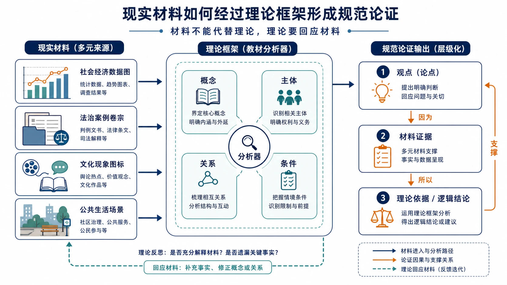
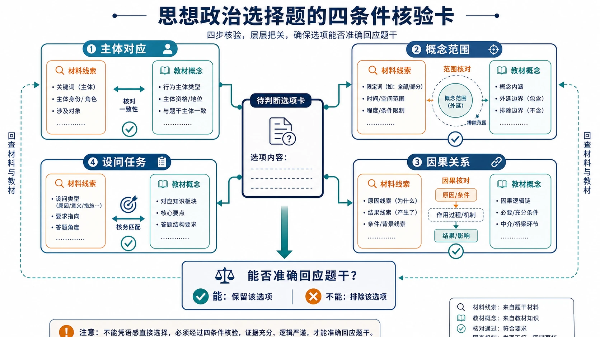
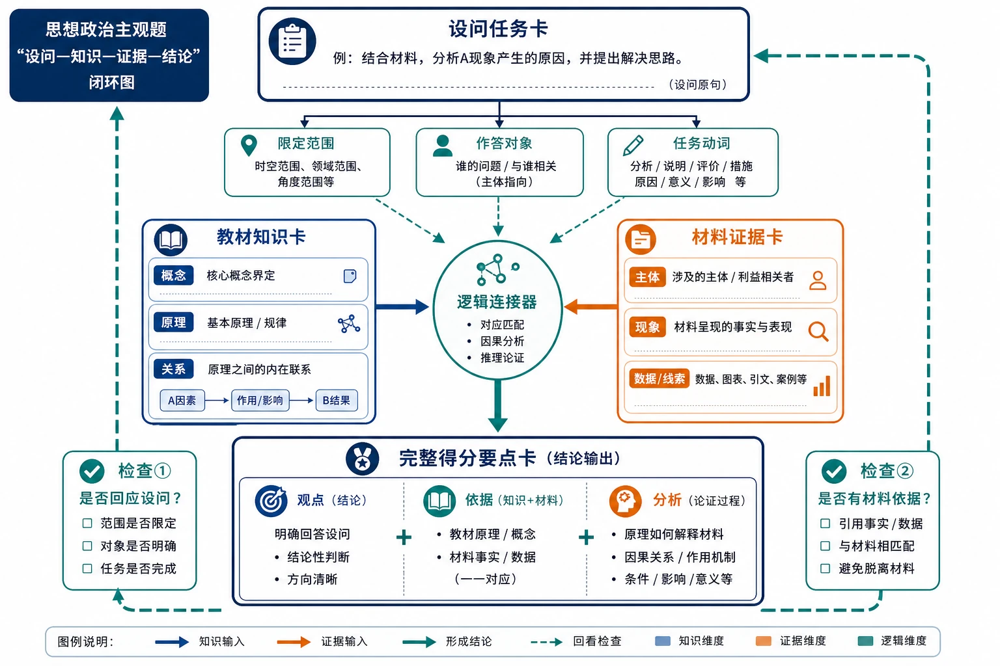

# 12 思想政治学科学习解读

“政治是不是把教材和时事背下来就行？”

“孩子平时很爱讨论新闻，为什么政治选择题总错？”

“主观题写了满满一页，为什么得分不高？”

思想政治看起来离生活很近：市场价格、科技发展、社会保障、法律责任、文化现象都能进入材料。但考试不是让学生自由评论，而是要求用学科理论解释真实问题。

> **先说结论：** 思想政治的核心学习链是“理论框架—材料证据—设问任务—规范论证”。时事提供情境，教材提供分析工具，设问决定答题方向。判断是否适合选政治，要看能否理解并复现理论、识别材料主体与逻辑、用规范语言完成论证，而不是只看记忆力或对新闻的兴趣。

<!-- 图片描述说明：文章头图，现实材料如何经过理论框架形成规范论证的结构图。左侧并列四类现实材料卡片：社会经济数据图、法治案例卷宗、文化现象图标、公共生活场景；它们通过箭头进入中部的“理论框架”分析器，分析器内部用概念、主体、关系、条件四个小模块表示教材工具。右侧输出三张层级清楚的论证卡：观点、材料证据、理论依据/逻辑结论，卡片之间以因果箭头连接。整体采用简洁、克制的教育信息图，不堆放口号、旗帜、人物表情或单向灌输视觉，重点呈现“材料不能代替理论、理论要回应材料”。 -->

## 一、思想政治主要学什么？

不同教材版本和学校安排可能有所差异，但高中思想政治通常包含以下相互联系的领域。

| 领域 | 关注的问题 | 主要学习任务 |
|---|---|---|
| 中国特色社会主义 | 社会发展道路、制度和历史逻辑 | 理解发展阶段与制度基础 |
| 经济与社会 | 市场、生产、分配、保障和发展 | 分析主体行为、政策原因和影响 |
| 政治与法治 | 国家治理、制度运行、公民参与、法治 | 区分主体、职能、权利与程序 |
| 哲学与文化 | 世界观、认识、矛盾、价值和文化 | 用原理分析变化、联系和选择 |
| 法律与生活 | 民事关系、权利义务、社会规则 | 识别法律关系并进行规则判断 |
| 逻辑与思维 | 概念、判断、推理和论证 | 检查观点是否清晰、推理是否有效 |

这些内容不是“背六本互不相关的书”。经济材料会涉及政治治理和价值选择，法律案例需要逻辑判断，文化现象也可以从社会存在与发展角度理解。

## 二、为什么“关心时事”不等于会做政治题？

时事能提供素材和现实感，但政治学科还要求四次转换：

1. 从新闻叙述中识别材料主体和核心问题；
2. 从生活语言转换为教材概念；
3. 根据设问确定原因、意义、措施或评析任务；
4. 用理论和材料共同形成结论。

学生若只记新闻结论，容易“知道这件事”，却不知道用哪个模块分析；若只背教材句子，又可能出现答案与材料没有对应。

时事的正确用途是帮助理解和练习迁移，不是取代教材框架。

## 三、选择题：不是凭语感，而是核对四个条件

政治选择题的干扰项常“每个字都熟悉”，问题藏在主体、范围、条件和逻辑中。

### 1. 主体是否对应？

材料中的主体是企业、政府、人大、司法机关、公民还是社会组织？不同主体的地位、职能和行为边界不能混用。

### 2. 概念范围是否扩大或缩小？

“有利于”不能偷换成“决定”，“重要条件”不能写成“唯一原因”。留意“都、只要、必然、根本、唯一”等绝对化词语。

### 3. 因果关系是否成立？

选项可能把结果写成原因，把相关关系写成因果，或加入材料没有支持的中间环节。

### 4. 是否回应题目要求？

一个选项本身可能正确，却与材料主旨或设问无关。政治选择题不只判断“知识对不对”，还要判断“是不是本题答案”。

推荐做法是给选项标注错误类型：主体错位、概念错用、范围扩大、因果倒置、材料无关。长期统计后，个人弱点会很清楚。

<!-- 图片描述说明：思想政治选择题的四条件核验卡。中央是一张待判断的选项卡，四周按顺时针设置主体对应、概念范围、因果关系、设问任务四个检查站；每站包含“材料线索”与“教材概念”两类小卡，通过对勾、范围边界和因果箭头进行核对。四站最终汇入“能否准确回应题干”的判断框，边缘有回查箭头，提示不能凭语感直接选择。画面强调逻辑核验过程，不使用政治口号、人物立场标签或简单的对错灌输。 -->

## 四、材料主观题：用“知识—材料—逻辑”形成闭环

### 第一步：拆设问

圈出知识范围、设问动词、分析对象和限定条件。例如“运用经济与社会知识，说明某项措施如何促进发展”，与“分析实施该措施的原因”答案结构不同。

### 第二步：给材料分层

材料通常不是一整块。按主体、问题、措施、结果或不同段落标出层次，每层提炼一个中心意思。

### 第三步：调用对应知识

从教材框架中选择最能解释该层材料的概念或原理。不是把能想到的知识全部写上，而是建立一一对应。

### 第四步：组织论证

一个完整要点通常包含：

**知识观点＋材料事实＋作用机制或逻辑结论。**

只写教材叫“空对空”，只抄材料叫“缺少学科分析”。两者要连接。

### 第五步：检查层次和重复

每个要点解决一个问题。避免几个要点换词重复，也避免一段塞入多条不同逻辑。

<!-- 图片描述说明：思想政治主观题的“设问—知识—证据—结论”闭环图。顶部是一张设问任务卡，经由拆解箭头分出“限定范围、作答对象、任务动词”三个小提示；左侧教材知识卡包含概念和原理的结构化信息位，右侧材料证据卡包含主体、现象和数据线索的标记位，两者以同等权重汇入中部的逻辑连接器，最终形成一张“观点—依据—分析”完整得分要点卡。末端用检查箭头回看是否回应设问、是否有材料依据。画面强调论证结构而非背诵句子，不使用空泛口号、堆叠长段文字或唯一标准答案。 -->

## 五、图表题：先描述事实，再解释原因

经济和社会材料可能出现柱状图、折线图、表格或注释。读图时按五步：

1. 看标题、时间、单位和统计对象；
2. 描述总体趋势；
3. 比较组间差异或结构变化；
4. 读取注释和特殊年份；
5. 再调用理论解释原因、影响或提出措施。

不能只写“增长很快”“发展很好”，应说明谁在什么时期怎样变化。也不能把图表没有展示的因果当成事实。

## 六、哲学题：先找关系，再找原理

哲学材料容易被关键词带偏。看到“创新”就写辩证否定，看到“实践”就写实践决定认识，往往不够。

更稳的方法是先问：

- 材料描述的是联系、发展、矛盾还是认识过程？
- 主体采取了什么行动，遇到什么条件？
- 设问要求说明方法论、原因还是评析观点？
- 哪条原理能完整解释材料关系？

哲学原理要写清基本内容，再说明材料怎样体现，最后落到方法或结论。不能只堆“坚持一切从实际出发、具体问题具体分析”等万能句。

## 七、法律与逻辑题：不要只靠生活常识

法律题要识别主体、法律关系、权利义务、行为和责任。生活中“觉得不公平”不等于完成法律判断，还要看规则、证据和程序。

逻辑题则要区分概念范围、判断类型、推理结构和论证漏洞。日常表达听起来顺畅，不代表逻辑上有效。

这两类内容共同提醒学生：政治学科的“现实性”不是随意表达，而是用规范工具分析现实。

## 八、怎样建立政治知识框架？

### 方法一：每个单元画“主体—行为—目的—影响”图

经济、政治和法律模块尤其适合按主体整理。谁能做什么、为什么做、会影响谁，是材料题的重要线索。

### 方法二：给原理配“适用问题”

不要只抄原理。每条知识旁写它常回答原因、意义、措施还是评析，以及最容易混淆的相近原理。

### 方法三：用现实材料做短分析

每周选择一则权威时事，用 100—200 字回答：材料主体是谁、涉及哪个模块、哪条原理最贴切、结论是什么。重点在短而准确，不在收藏数量。

### 方法四：建立错项词典

把选择题中的高频误区按主体、范围、因果、概念和无关项分类，记录自己最常掉进哪类陷阱。

## 九、思想政治常见失分诊断

| 错因 | 典型表现 | 改进动作 |
|---|---|---|
| 框架不全 | 知识零散，定位不到模块 | 每单元制作一页结构图 |
| 主体混淆 | 企业、政府、人大等职能混用 | 制作主体—职能—行为表 |
| 概念边界 | 熟悉词语却判断错误 | 用正例、反例和限定词比较 |
| 设问偏离 | 原因题写成意义，措施题只复述问题 | 圈知识范围、动词、对象、条件 |
| 材料脱节 | 只背教材或只抄材料 | 每点使用知识—材料—逻辑闭环 |
| 表达重复 | 写得多但要点重合 | 一段一意，先列提纲再作答 |

“背得不够”只是可能原因之一。很多学生真正的问题是不会定位、不会对应或不会论证。

## 十、从高一到高三，政治怎样学习？

### 高一：先搭框架，再记细节

每学一个单元，先知道它解决什么问题、有哪些主体和核心概念，再把知识填入结构。孤立背句子最容易遗忘。

### 高二：加强跨模块材料分析

随着哲学、文化、法律与逻辑等内容增加，要训练同一现实问题从不同模块分析，同时严格服从设问范围。

### 高三：把知识转化为快速调用能力

复习时按设问任务整理原因、意义、措施、评析和开放性题目。通过限时训练提高材料分层和要点组织速度。

## 十一、什么样的学生更可能适合选思想政治？

### 适配信号

- 对社会、经济、公共事务和规则有持续兴趣；
- 愿意理解理论框架并准确记忆概念；
- 能耐心阅读材料，区分主体、条件和逻辑；
- 愿意训练规范表达，而不是只写个人感受；
- 错题分类后，主体和概念错误会减少；
- 政治学习投入与排名相对稳定。

### 慎选信号

- 认为政治可以靠考前背热点突击；
- 长期不愿整理框架，主观题只堆关键词；
- 对长材料、理论概念和书面表达持续排斥；
- 关注新闻但拒绝回到教材原理；
- 选择理由只有“听说好赋分”或“其他科更难”。

## 十二、一个案例：爱看新闻，为什么选择题仍不稳定？

示例学生小航每天关注新闻，政治课也积极讨论，但选择题经常错在政府、人大、企业等主体关系上。复盘发现，他记得事件，却没有建立主体和职能框架。

他连续六周使用“主体—行为—依据—影响”表，并给每道错题标错误类型。之后主体错位明显减少，材料兴趣才真正转化为学科能力。

这个案例说明，兴趣是动力，不是自动得分工具。选科要观察兴趣能否支持系统训练。

## 十三、思想政治可能连接哪些专业方向？

思想政治与马克思主义理论、思想政治教育，以及部分政治学、公共管理、社会学、法学、新闻传播和公共事务方向常有联系。部分公安类院校、公安专业或特殊招生也可能提出思想政治要求及其他条件。

专业名称不能替代查询。法学、公共管理等并非所有高校都统一要求政治；特殊招生还可能涉及政治考察、体检、面试或体能等条件。

## 十四、学生和家长现在可以做什么？

- [ ] 任选一个单元，画出主体、行为、依据和影响关系图。
- [ ] 把最近三次选择题错误分为主体、范围、因果、概念和无关项。
- [ ] 用“知识—材料—逻辑”重写一道主观题答案。
- [ ] 连续 8—12 周记录政治排名、投入和主观题得分变化。
- [ ] 核验感兴趣专业及特殊招生是否明确要求思想政治。

下一篇将继续讨论一门常被误解为“背年代”的学科：历史怎样从事实记忆走向证据解释？请继续阅读：[历史学科学习解读](13-历史学科学习解读.md)。

## 重要提示与参考

本文更新于 2026 年 8 月。时事材料需关注来源与时间，不能替代教材原理；专业和特殊招生要求请以本省及高校当年官方信息为准。

- [教育部：普通高中课程方案和各学科课程标准](https://hudong.moe.gov.cn/jyb_xxgk/xxgk/neirong/fenlei/kcjc/kcjc_js/kcjcjs_xkkcbz/)
- [教育部：普通高中课程方案和语文等学科课程标准（2017年版2020年修订）](https://jsj.moe.gov.cn/n2/1/1/1507.shtml)
- [阳光高考：2027年各省市普通高校本科专业选考科目要求汇总](https://gaokao.chsi.com.cn/gkxx/ss/202502/20250225/2293354644.html)
