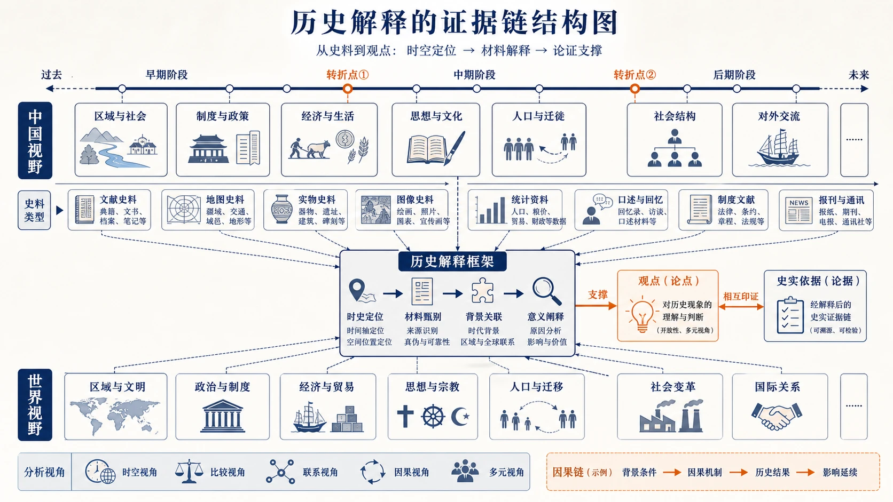
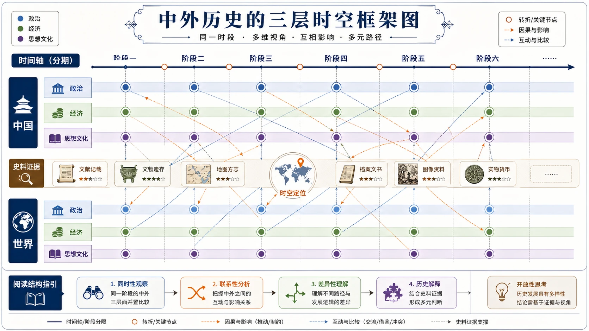
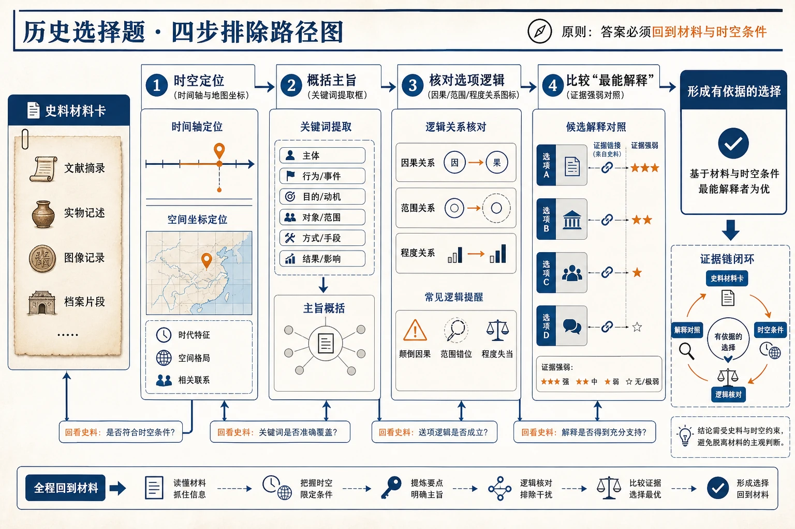

# 13 历史学科学习解读

“历史是不是把年代、人物和事件背熟就行？”

“孩子很喜欢历史故事，为什么材料题总找不到答案？”

“语文成绩不错，是不是就适合选历史？”

历史学习当然离不开记忆，但事实不是终点，而是解释和论证的证据。高中历史不仅问“发生了什么”，还会追问：为什么发生、发生了怎样的变化、材料能证明什么、不同解释为何不同。

> **先说结论：** 高中历史的核心学习链是“时空定位—史料信息—历史解释—观点论证”。记忆负责提供基本事实，时空框架负责组织事实，史料阅读负责寻找证据，论证负责回答问题。判断是否适合选历史，要看能否长期整理线索、阅读材料、比较变化并用史实支持观点，而不是只看故事兴趣或语文成绩。

<!-- 图片描述说明：文章头图，历史解释的证据链结构图。横向时间轴贯穿画面，上方和下方分别展开中国与世界的区域节点，以平等方式表现同一时期的并行与联系；时间轴旁插入史料卡片、历史地图、统计表和人物/制度图标等证据来源。多条细线将证据汇入中部的“历史解释”框架，框架再输出“观点”与“史实依据”两张相连卡片，体现事实要经过时空定位和材料解释才能支撑论证。整体使用浅纸色或白底、深蓝线条、橙色转折点的历史结构图风格，不画戏剧化战争场面、不堆砌具体事件、不给单一结论贴标签。 -->

## 一、历史主要学什么？

高中历史内容跨度大，可以用三种结构同时组织。

### 1. 按时间：建立发展顺序

从古代、近代到现代，理解不同阶段的重要变化。时间不是只记年份，而是帮助判断事件的先后、背景和阶段特征。

### 2. 按空间：建立区域联系

中国史和世界史不是两条完全分离的线。文明交流、贸易、战争、技术和制度变化会跨区域发生影响。

### 3. 按主题：建立纵向专题

政治制度、经济发展、社会生活、思想文化、科技、民族与国际关系等主题，可以跨时期比较。

| 组织方式 | 解决的问题 | 常用工具 |
|---|---|---|
| 时间线 | 先后顺序和阶段变化 | 年代轴、阶段表 |
| 空间图 | 区域位置和交流联系 | 地图、路线图 |
| 主题链 | 同一问题怎样长期演变 | 专题表、比较表 |
| 因果网 | 多种因素怎样共同作用 | 背景—过程—影响图 |

只按教材页码记忆，知识容易碎；把三种结构叠加，才能在陌生题目中快速定位。

## 二、初高中历史最大的变化是什么？

### 1. 从“知道事实”走向“解释事实”

记住改革、战争或制度名称后，还要理解其背景、内容、影响和历史条件。题目经常换一个角度，让学生重新组织所学。

### 2. 从课本叙述走向多种史料

文字记载、统计表、地图、图片、法令、日记和学者观点都可能出现。材料并非都同样可靠，也可能带有立场和时代限制。

### 3. 从唯一答案走向有证据的解释

同一历史现象可以从政治、经济、社会和文化等角度解释。多角度不等于随意回答，每种解释都要有证据和逻辑。

### 4. 从背诵段落走向任务化表达

概括变化、分析原因、比较异同、评价影响、论证观点，分别需要不同答案结构。背下整段教材，不一定回应设问。

## 三、建立时空框架：历史学习的第一块底板

### 时间线不要只写年份

一条有用的时间线至少包括：阶段名称、代表事件、政治经济特征、与前后阶段的变化。年份只负责定位，阶段特征才负责解释。

### 地图不要只看地名

看到地图要问：区域范围怎样变化？交通和资源在哪里？不同力量如何分布？空间位置怎样影响事件过程？

### 中外历史要建立“同时发生”意识

把同一时期的中国与世界事件并列，可以理解全球联系和不同发展路径，也能避免把世界史事件孤立记忆。

<!-- 图片描述说明：中外历史的三层时空框架图。横向是一条分期但不填写具体事件的时间轴，纵向分为“中国”和“世界”两条平行轨道；每条轨道内再以三种克制颜色区分政治、经济、思想文化三个层面。对应时间段的同色节点通过细线交叉连接，表现同时发生、相互影响或不同路径的比较关系；中间保留少量史料卡和地图定位图标作为证据提示。版式应像可复习的历史结构表，信息层级清楚、留白充足，不填大量年代人物，不把中外历史画成彼此孤立的两条线。 -->

## 四、史料阅读：先问材料是谁说的、为什么说

读史料可以按六个问题进行：

1. **来源：** 这是法令、日记、报刊、统计还是后世研究？
2. **时间：** 写于事件当时还是事后？
3. **主体：** 谁在说，处于什么身份和立场？
4. **对象：** 材料讨论什么地区、群体或事件？
5. **信息：** 哪些是材料直接提供的事实或观点？
6. **限度：** 这份材料能证明什么，不能证明什么？

材料题最常见的错误有两个：一是只抄原句，没有概括；二是脱离材料，把背过的知识全部写上。正确做法是先提取材料信息，再用所学解释。

## 五、历史选择题：四步排除“看起来都对”

### 第一步：时空定位

抓时间、地点、人物、制度和关键词，判断大致阶段。若材料没有明确年代，就从制度、技术、称谓和社会特征推断。

### 第二步：概括材料主旨

不要被一个熟悉词语带走。先用一句话概括材料强调的变化、关系或观点。

### 第三步：核对选项逻辑

检查选项是否时间错位、因果倒置、范围扩大、程度过强或材料无据。

### 第四步：比较“最能解释”

有些选项本身是历史事实，但不是材料的最佳解释。选择题要求证据匹配，而不是知识点越大越好。

<!-- 图片描述说明：历史选择题四步排除路径图。由一张史料材料卡出发，依次经过时空定位（时间轴与地图坐标）、概括主旨（关键词提取框）、核对选项逻辑（因果/范围/程度关系图标）、比较“最能解释”（多张候选卡与证据强弱标记）四个步骤，最终形成一个有依据的选择。每一步都保留返回史料的细箭头，强调答案必须回到材料与时空条件；不放具体试题、年代人名或把历史选择题画成纯记忆竞赛。 -->

## 六、材料题：按设问动词选择答案结构

### 概括类

从材料中提炼共同点、差异或变化，尽量使用上位概念，不照抄长句。

### 原因类

区分背景、直接原因、根本因素和具体条件。可从政治、经济、社会、思想、技术和外部环境等角度组织，但必须与题目对象相关。

### 影响类

明确影响对象、方向、范围和时间。可区分积极与局限、当时与长远、国内与国际，避免只写空泛的“促进发展”。

### 比较类

先确定比较维度，如背景、目的、内容、方式、结果和影响，再逐项比较。不能一边写 A、一边写 B，却没有共同维度。

### 评价类

把历史对象放回当时条件中，说明作用、局限和历史位置。避免用今天的标准简单赞扬或否定。

## 七、论述题：观点不是口号，史实不是堆积

一篇短论述至少有四部分：

1. **明确观点：** 直接回应题目，范围适中；
2. **选择证据：** 史实真实、典型且与观点相关；
3. **解释联系：** 说明证据为什么支持观点；
4. **形成结论：** 回扣主题，必要时说明条件或限度。

常见问题是列了很多事件，却没有解释它们与观点的关系。每个史实后都要问一句：“所以它证明了什么？”

论述题也不追求固定模板。观点必须由材料和所学支持，证据应覆盖题目要求的时间或空间范围。

## 八、怎样记忆历史，才不会越背越乱？

### 方法一：先框架，后细节

先知道一个单元的阶段和主题，再填人物、事件和制度。没有抽屉，记忆就只能堆在桌面上。

### 方法二：用因果链，不背孤立结论

把背景、触发、过程、结果和影响连起来。因果关系越清楚，事实越容易提取。

### 方法三：用比较表处理易混内容

相似改革、制度、思想和国际体系可按时间、背景、内容、性质、影响比较。比较维度固定，记忆更稳定。

### 方法四：主动回忆代替反复阅读

合上书，尝试画时间线、讲述过程或回答问题，再回书中补漏。能主动提取，才说明记忆可用于考试。

## 九、历史常见失分诊断

| 错因 | 典型表现 | 改进动作 |
|---|---|---|
| 时空错位 | 事件、制度、人物年代混淆 | 建阶段轴和同一时期中外对照 |
| 知识碎片 | 每个点都见过，无法解释联系 | 用主题链和因果网重组 |
| 材料误读 | 抄材料或忽视来源立场 | 使用六问史料法 |
| 设问偏离 | 原因、影响、特点答混 | 给设问动词匹配结构 |
| 证据不足 | 观点正确但没有史实支持 | 建主题史实证据库 |
| 表达空泛 | 只写“促进发展、影响深远” | 写清对象、机制、方向和范围 |

错题本可增加“错误年代、遗漏证据、错误逻辑”三栏。历史错题不只是背错一个知识点，也可能是材料阅读和论证方法有问题。

## 十、从高一到高三，历史怎样学习？

### 高一：建立基本时间轴和阶段特征

每学完一个单元，用一页纸整理时间、空间、主题和因果。先保证事实准确，再追求复杂解释。

### 高二：加强专题比较和史料阅读

把不同地区、不同时期的相似问题放在一起比较，训练来源、立场、证据和限度意识。

### 高三：从教材顺序转向问题结构

按国家治理、经济发展、社会变迁、思想文化、文明交流等主题整合，限时训练概括、比较、评价和论证。

## 十一、什么样的学生更可能适合选历史？

### 适配信号

- 对社会变化、制度、文化和文明交流有持续兴趣；
- 愿意建立时间线，而不是只看故事；
- 能耐心阅读材料并区分事实与观点；
- 愿意训练概括、比较和论证表达；
- 订正后能减少时空错位和证据遗漏；
- 多次排名和学习投入相对稳定。

### 慎选信号

- 只喜欢人物故事，排斥制度、经济和史料分析；
- 认为语文好就自然会历史，不愿建立知识框架；
- 长期靠考前突击，知识始终碎片化；
- 材料题和论述题高投入低提升且不愿调整；
- 选择历史只是为了回避物理，没有比较自身证据。

## 十二、一个案例：背得不少，材料题为什么不稳定？

示例学生小岚能复述很多事件，材料题却常把答案写成教材段落。分析后发现，她读材料时没有标来源、时间和观点，也没有按设问动词组织答案。

她连续八周训练两件事：每则材料先做六问标注；每道题先写“概括、原因、比较或评价”的答案骨架。之后材料抄写减少，要点更集中。

这说明记忆不是无用，而是需要通过史料阅读和设问结构转化为得分能力。

## 十三、历史可能连接哪些专业方向？

历史与历史学、世界史、考古、文物与博物馆、文化遗产等方向联系直接，也能为文学、哲学、教育、新闻传播、社会学、法学和公共管理等部分方向提供人文基础。

但相关专业并非都统一要求历史。“3+1+2”地区还要考虑物理或历史首选科目类别及专业组安排，具体资格须按省份、年份、院校和专业核验。

## 十四、学生和家长现在可以做什么？

- [ ] 为一个历史阶段制作“时间—空间—主题—特征”一页图。
- [ ] 用六问史料法分析一段材料。
- [ ] 把最近三次错题分为时空、知识、材料、设问、证据和表达六类。
- [ ] 连续 8—12 周观察选择题、材料题和论述题表现。
- [ ] 核验目标专业是否要求历史，以及本省首选科目类别规则。

下一篇将进入自然与人文交叉的学科：地理为什么既要理解自然过程，又要分析城市、产业和区域？请继续阅读：[地理学科学习解读](14-地理学科学习解读.md)。

## 重要提示与参考

本文更新于 2026 年 8 月。具体课程结构和教学顺序以学校安排为准；专业资格及首选科目类别以本省和高校当年官方信息为准。

- [教育部：普通高中课程方案和各学科课程标准](https://hudong.moe.gov.cn/jyb_xxgk/xxgk/neirong/fenlei/kcjc/kcjc_js/kcjcjs_xkkcbz/)
- [教育部：普通高中课程方案和语文等学科课程标准（2017年版2020年修订）](https://jsj.moe.gov.cn/n2/1/1/1507.shtml)
- [阳光高考：2027年各省市普通高校本科专业选考科目要求汇总](https://gaokao.chsi.com.cn/gkxx/ss/202502/20250225/2293354644.html)
