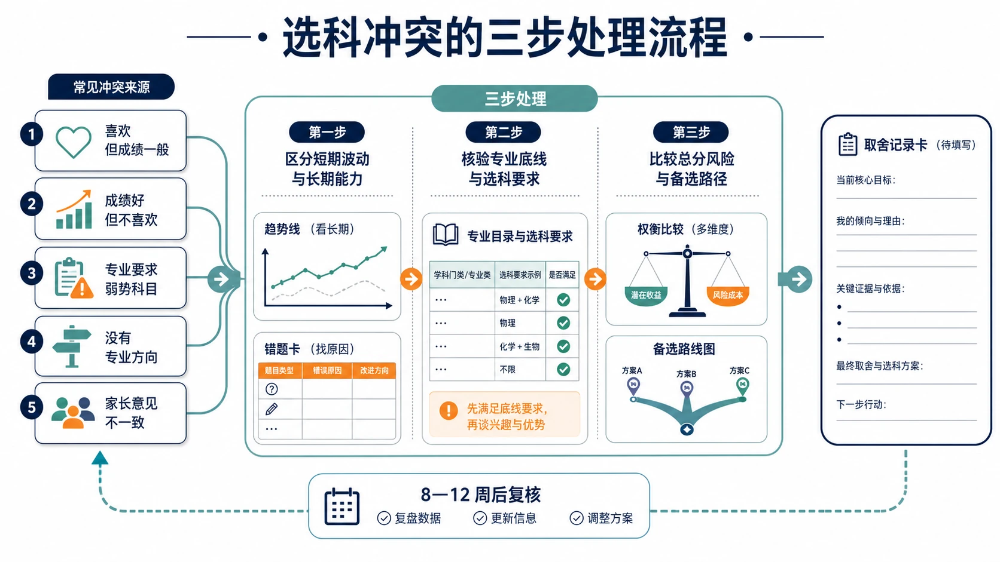
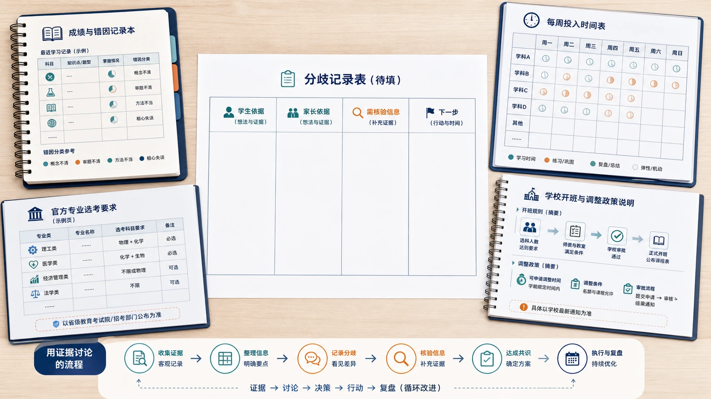
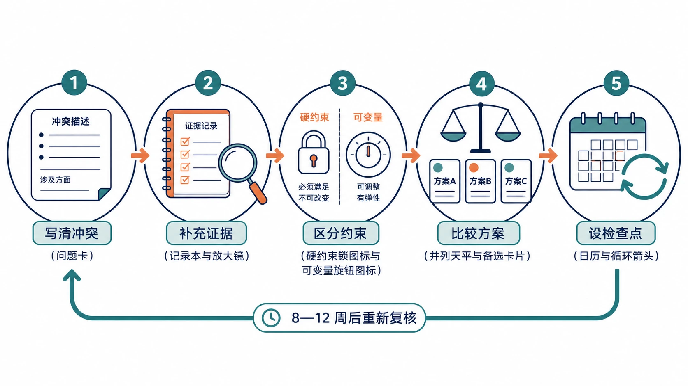

# 16 兴趣、成绩和专业方向冲突时怎么办？

“孩子特别喜欢生物，可成绩一直中等，这种喜欢能选吗？”

“物理分数最高，可孩子一提物理就烦，到底该不该选？”

“目标专业要求物理，可物理恰恰是弱科，硬选还是放弃？”

选科时，几乎不存在“喜欢、擅长、专业要求、家长期望全都一致”的理想状态。多数家庭真正要处理的，不是没有冲突，而是冲突发生时按什么顺序处理。处理顺序错了，讨论就会变成情绪争论；顺序对了，每个矛盾都能转成可补充的信息和可执行的方案。真正重要的不是消除冲突，而是按顺序处理：先区分短期波动与长期能力，再核查专业底线，最后比较总分风险与可执行空间。

> **先说结论：** 冲突处理按三步走：先区分短期波动与长期能力，再核查专业底线，最后比较总分风险与可执行的提升空间。没有唯一正确答案；成熟的取舍是每一项决定都能说出依据、记录验证过程，并保留可接受的备选方案。

<!-- 图片描述说明：文章头图，选科冲突的三步处理流程。画面左侧并排列出五张常见冲突卡片：喜欢但成绩一般、成绩好但不喜欢、专业要求弱势科目、没有专业方向、家长意见不一致；五张卡片汇入中部的“三步处理”通道：第一步用趋势线与错题卡表示区分短期波动与长期能力，第二步用专业目录与对勾图标表示核验专业底线，第三步用天平与备选路线图表示比较总分风险；通道出口是一张留有空白待填的“取舍记录卡”，下方保留“8—12 周后复核”的循环箭头。整体为冷静、可操作的教育流程视觉，不出现争吵画面、输赢标签或唯一正确答案暗示。 -->

## 一、先分清冲突是哪一类

表面相似的“纠结”，内部原因可能完全不同。先给冲突分类，才能对症处理。

| 冲突类型 | 典型表述 | 核心矛盾 |
|---|---|---|
| 兴趣与成绩 | “我喜欢生物，但成绩一般” | 愿望与当前实力不一致 |
| 成绩与感受 | “物理分数最高，但我不喜欢” | 实力与长期意愿不一致 |
| 成绩与专业要求 | “目标专业要物理，可物理弱” | 个人条件与外部资格不一致 |
| 方向缺失 | “我不知道以后想学什么” | 信息不足，而非能力不足 |
| 家庭分歧 | “爸爸让我选物化，我想选别的” | 两套依据没有放在同一张桌面上 |

无论哪种类型，处理顺序相同：先用数据判断个人情况，再核验外部要求，最后比较方案。先诊断，再查要求，最后取舍。

## 二、情况一：喜欢某科，但成绩一般

### 第一步：判断问题类型

先问两个问题：

1. 成绩一般是因为基础断层，还是核心能力长期不足？例如化学分数低，是元素化合物基础没补，还是反应原理始终无法理解。
2. 是暂时低谷，还是长期瓶颈？一次试卷难、状态差造成的波动，与连续多次停留在同一水平，含义不同。

### 第二步：补充信息

需要补四类信息：错因结构（记忆、计算、模型、表达中哪类为主）、实际投入与改错效果、任课教师反馈、兴趣是否指向学科核心任务。

最后一点尤其重要。喜欢动物和愿意做遗传推理不是一回事；喜欢新闻和愿意整理理论框架也不是一回事。兴趣必须落到具体任务上才有验证价值。

### 第三步：行动方案

设置 8—12 周观察期，只调整 1—2 个最关键动作。例如化学只补知识网络和实验逻辑，物理只练过程图和规范列式。期间记录投入、错因和 2—3 次测评变化。

观察结束时给出三档结论：继续作为优势候选、保留观察、谨慎选择。“喜欢但成绩一般”本身既不是放弃理由，也不是选择理由；它只说明需要验证，验证后结论才有依据。

## 三、情况二：成绩很好，但不喜欢

“分数高”是当前状态的证据，“不喜欢”是长期意愿的信号。两者冲突时，不能简单用一项否定另一项，而要拆开看。

### 第一步：判断不喜欢的是什么

把学科拆成主要任务，逐项标注“能接受”或“排斥”。例如物理可以拆成建模、计算、实验、图像；历史可以拆成时间线、史料阅读、比较分析、书面论证。

如果排斥的是教师风格、班级氛围或当前章节，属于环境与内容问题，换环境或换章节后可能缓解；如果排斥的是学科核心任务本身，属于长期意愿问题，即使分数高也要谨慎。

### 第二步：记录真实感受

建议连续记录 4—6 周学习感受，区分“做完后觉得累”和“过程中就排斥”。前者可能是正常的消耗，后者才说明持续困难。

### 第三步：行动方案

- 若属于暂时疲惫或对教学方式不适：调整节奏，保留观察，不必立即定论；
- 若核心任务长期排斥：即使当前分数高，也要评估三年能否维持，并把“靠意志硬撑”计入成本；
- 无论哪种，都把分数和感受分开记录，避免用情绪替代数据。

## 四、情况三：目标专业要求弱势科目

这是最典型、也最需要按顺序处理的冲突。

### 第一步：确认目标坚定程度

“想学计算机”“想学医”这类表述太宽。先列出 3—5 个具体专业和若干备选方向，判断目标是“非它不可”还是“可以替代”。目标越具体，后续核验越有效。

### 第二步：查询替代专业与院校差异

按本省、目标高考年份，用官方目录核验不同院校、不同专业的选考要求。同一方向的院校差异往往很大：有的要求物理，有的要求物理和化学均须选考，有的可能不提科目要求。不要只查一两所“理想院校”，样本应覆盖理想、匹配和保底层次。

### 第三步：判断弱势科目能否提升

先把失分分类：基础断层、计算规范、模型识别、投入不足，还是长期对核心任务不适配。再设置 8—12 周专项观察，记录同类错误是否减少。能修复与不能修复，是两种完全不同的决策情形。

### 第四步：评估总分风险

保留弱势科目会带来额外投入。要比较的不是“能不能选”，而是：增加投入后总分是上升还是下降？是否挤压语数外和其他选科？学校是否开班、是否允许后续调整？专业资格的价值，只有在总分竞争力不受根本伤害时才能兑现。

推荐用[大学专业调查表](../09-实用工具与附录/04-大学专业调查表.md)完成专业核验，把“省份—年份—院校—专业（组）—要求”逐项记录。

## 五、情况四：没有专业方向

“没有方向”常常不是真的没有，而是还没有系统调查。此时最重要的不是强迫自己“想出来”，而是用方法缩小范围。

### 第一步：优先保留可能性

方向未定时，避免过早放弃影响面较大的基础学科。尤其在常见“3+1+2”或“3+3”框架下，物理、化学涉及较多理工农医专业的选考要求，过早放弃可能在未来核验方向时失去资格。当然，这只是保留观察的倾向，不是必须选择的结论。

### 第二步：从专业大类开始探索

可以先按大类浏览：理学与工学、医学与健康、经济与管理、法学与社会、人文与教育、艺术与体育等。每类记下 1—2 个“不排斥、愿意了解”的方向，不必立刻确定。

### 第三步：用组合反推

选 2—3 个候选组合，查它们分别保留哪些专业大类。例如保留物理的组合可能打开更多理工方向，政史地组合可能更集中人文社会方向。用资格结果反推，比凭空想象更可靠。

### 第四步：设定复查点

没有方向时，成绩、投入和错因成为更重要的依据；同时约定在完成专业调查后（例如下一学期）重新复核，不把“暂时没方向”当成永远没方向。

## 六、情况五：家长和学生意见不同

意见不同不是问题，没有证据的坚持才是问题。家长掌握的信息（政策、专业、就业）和学生掌握的信息（感受、课堂、学习体验）本来就不对称，讨论的目的不是说服对方，而是把两套信息放到同一张桌面上。

### 第一步：各自列出理由

学生回答：我喜欢什么、讨厌什么、愿意承担什么、依据是什么。家长回答：担心什么、看重什么、有什么数据或官方信息支撑。只陈述，不评价对方。

### 第二步：把“事实”和“担心”分开

专业要求、成绩记录、学校开班政策属于事实，可以用官方信息核验；就业前景、个人经验属于担心或推测，不能当作硬依据。例如“计算机必须选物理”是未经核验的表述；“本省目录中计算机类多数要求物理”才是可查的事实。

### 第三步：用数据讨论

讨论时只摆四类材料：连续成绩与错因记录、投入记录、官方专业要求、学校开班与调整政策。学生至少参与部分决策：理解选择理由，并愿意执行对应的学习计划。

可以使用[家长与学生沟通清单](../09-实用工具与附录/05-家长与学生沟通清单.md)记录分歧、双方依据和需要补充核验的信息。

<!-- 图片描述说明：家庭选科讨论的资料桌图。俯视一张讨论桌，桌上只放四类物品：成绩与错因记录本、每周投入时间表、打印或打开的官方专业选考要求页、学校开班与调整政策说明；桌面中央留白处放一张待填的分歧记录表，表中包含学生依据、家长依据、需核验信息和下一步四栏。画面没有争吵人物、放大音量或输赢情绪，用平静、可继续讨论的桌面传达“用证据讨论”的主题。 -->

## 七、一个案例：目标专业要求弱势科目，怎样一步步走完

小远高一，想读计算机或电子信息类方向，数学不错，但物理中等偏下，运动学综合题经常失分。爸爸坚持“计算机必须选物理”，小远觉得物理拖后腿，想放弃。两人的争论正好同时踩中情况三和情况五。

### 第一步：核验专业要求

小远按本省和适用年份，在官方目录中调查了 15 个不同层次院校的计算机类、电子信息类及相关专业。结果并不统一：多数目标院校提出物理要求，部分还同时要求化学，少数院校或专业不提科目要求或允许物理、化学任选一门。结论被修正为：不是“必须选物理”，而是“多数目标方向要求物理”。

### 第二步：诊断物理错因

把近五次物理失分分类后发现，概念题和实验题尚可，错因集中在运动学模型识别和计算步骤，属于相对可修复的模块，而不是“完全没有物理思维”。

### 第三步：设置八周观察

八周内只做两个动作：每道综合题先画过程图再列式；每周完成三次同类变式并记录正确率。八周后，同类错误明显减少，物理排名小幅上升，每周额外投入约 3 小时，没有明显挤压其他科目。

### 第四步：比较方案

- 方案 A：保留物理。多数目标方向保留资格，需要继续补漏，但改善路径已经验证；
- 方案 B：放弃物理。部分目标专业变为不可报，转向管理类或不限科目方向，总投入下降但方向范围收窄。

### 第五步：家庭讨论

小远和爸爸把专业核验表和八周记录放在一起：事实层面，目标方向确实以要求物理为主；个人层面，物理问题可修复且投入可承受。最终小远选择保留物理，同时把一两个不要求物化的相关方向列为备选，并约定高三前再次复核专业要求与成绩变化。

这个结果只属于小远。如果另一名学生八周后没有改善、投入已明显挤压语数外，结论可能完全相反。案例的价值是演示流程：先诊断、再核验、后取舍，而不是给出一个通用答案。

## 八、冲突处理的统一流程

把五种情况合在一起，处理流程是一致的：

1. 写清冲突：用一句话说清“什么和什么在冲突”；
2. 补充证据：成绩、错因、投入、兴趣记录、教师反馈、官方专业要求；
3. 区分约束：哪些是硬约束（如专业资格），哪些是可变量（成绩可提升、兴趣可培养）；
4. 比较方案：为 2—3 个方案各列支持证据与风险；
5. 设检查点：8—12 周后复核，确认学校开班与调整政策，保留调整空间。

<!-- 图片描述说明：冲突处理统一流程的循环图。五个节点按顺序连接：写清冲突（问题卡）、补充证据（记录本与放大镜）、区分约束（硬约束锁图标与可变量旋钮图标）、比较方案（并列天平与备选卡片）、设检查点（日历与循环箭头）；最后一个节点用回环箭头连回第一步，表示 8—12 周后重新复核。所有节点等权，不使用“正确选择”或“输赢”视觉。 -->

## 九、处理冲突最常见的五个误区

### 误区一：把“喜欢”直接等同于“适合”

喜欢提供动力，适合需要成绩、投入和任务完成度共同支撑。

### 误区二：用分数否定感受，或用感受否定分数

两者是不同层面的证据。分数回答现状，感受回答长期意愿，缺一不可。

### 误区三：把专业名称当唯一标准

专业名称不能替代官方核验。同一专业在不同院校、不同省份、不同年份的要求可能不同。

### 误区四：把冲突当成二选一

观察期、备选组合、相近专业和调整政策都提供了中间选项。先确认选项是否存在，再谈取舍。

### 误区五：家长替学生做决定，学生不参与验证

学生至少要理解选择依据并承担学习计划。没有参与的决策，很难在三年学习中真正落地。

## 十、读完这篇，完成五项行动

- [ ] 用一句话写出当前最核心的冲突是什么。
- [ ] 为每个候选组合各列出三项支持证据和三项风险证据。
- [ ] 用[大学专业调查表](../09-实用工具与附录/04-大学专业调查表.md)核验目标专业的选考要求。
- [ ] 为弱势科目设置 8—12 周观察期，只调整 1—2 个动作。
- [ ] 与家长完成一次基于数据的讨论，并记录分歧、依据和下一步。

冲突中反复出现的“专业要求”，是选科中最容易看错、也最影响结果的一环。专业选考要求到底有哪几种形式，怎样查才不出错？请继续阅读：[选科如何影响大学专业报考](../05-连接大学专业与职业/17-选科如何影响大学专业报考.md)。

## 重要提示与参考

本文更新于 2026 年 8 月。文中案例为演示判断方法的虚构记录，不代表固定分数线、选科结论或录取结果。不同招生省份、适用年份、院校和专业（组）的选考要求可能不同，请以本省教育考试机构和高校当年正式信息为准。

- [教育部：普通高中课程方案和语文等学科课程标准（2017年版2020年修订）](https://www.moe.gov.cn/srcsite/A26/s8001/202006/t20200603_462199.html)
- [教育部：新高考带来哪些新变化](https://www.moe.gov.cn/jyb_xwfb/s5147/202109/t20210914_562841.html)
- [阳光高考：2027年各省市普通高校本科专业选考科目要求汇总](https://gaokao.chsi.com.cn/gkxx/ss/202502/20250225/2293354644.html)
