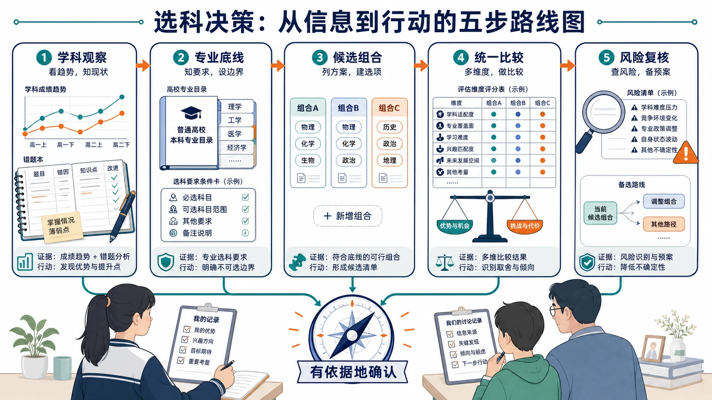
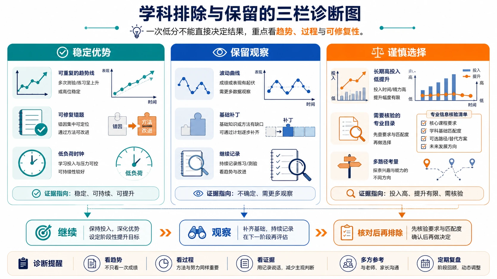
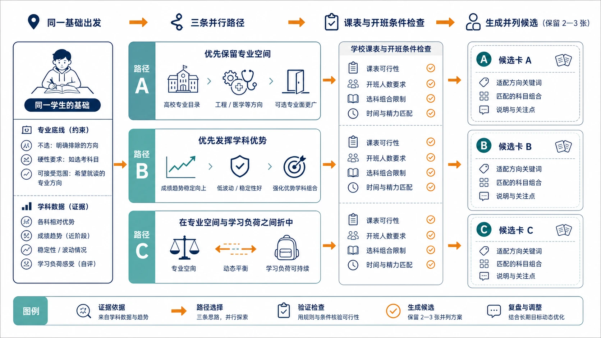

# 20 高中选科的五步决策法

“物化生、物化地、物生地，到底选哪一个？”

走到选科确认前，很多家庭都会陷入一种疲惫：资料看了不少，组合也列了几种，可每个组合都有优点，每个组合也都能找到风险。学生担心选错，家长担心漏掉专业，最后常常变成一句“大家都这样选”。

但选科不是猜答案，也不是寻找一张网上的“最佳组合榜”。它更像一次需要留下证据的决策：你为什么排除某门科目？为什么保留某个专业方向？为什么在两个组合之间做出取舍？如果以后回看，能不能说清楚当时依据了什么、哪些信息还存在不确定性？

> **先说结论：** 选科可以按五步完成：先排除长期不适合的科目，再确定必须守住的专业底线；接着保留 2—3 个候选组合，用统一标准比较，最后做一次反向风险检查。评分表只能帮助整理思路，不能替代本省政策、院校专业要求和真实学习数据。

> **适用范围提醒：** 本文提供的是决策方法，不预设某个省份、某种选科模式或某个固定组合。无论所在地区实行“3+3”还是“3+1+2”，都应先核对本省招生规则、适用年份、院校专业（组）要求和学校开班安排。

<!-- 图片描述说明：文章头图，选科决策从信息到行动的五步路线图。画面横向连接五个等大的流程节点：学科观察用趋势图和错题本表示，专业底线用高校目录与条件卡表示，候选组合用两到三张并列组合卡表示，统一比较用评分表与天平表示，风险复核用放大镜、警示标记和备用路线表示。五个节点最终汇入一枚“有依据地确认”的指南针，学生和家长共同站在流程旁查看记录；不出现“最佳组合”、冠军榜、焦虑倒计时或保证录取的视觉。 -->

## 一、选科决策不是寻找标准答案

先把“选对”这件事说清楚。对不同学生而言，选对可能意味着不同结果：有人需要保留医学或工程方向，有人更看重在三门科目中形成稳定优势，有人需要优先考虑学校是否能开班，还有人暂时没有明确专业目标，只能先把不适合项排除并延长观察。

因此，选科决策至少要同时回答四个问题：

1. **能不能报：** 候选组合是否满足目标院校和专业的选考要求？
2. **能不能学：** 三门科目的学习方式、基础和长期投入是否匹配？
3. **能不能稳：** 在连续测评中，成绩和相对位置能否保持或改善？
4. **能不能落地：** 学校是否开设组合，走班、师资和课表是否支持？

只回答其中一个问题，结论都可能失真。比如，“能报很多专业”解决的是资格范围，却没有回答学生能否把三科稳定学好；“当前分数很高”说明了某一阶段表现，却没有回答专业要求和学校开班条件。

**学生要做的：** 把“我喜欢什么”“我担心什么”“我愿意投入什么”写下来，不急着写组合名称。

**家长要做的：** 提供信息和提问，不替学生宣布答案。家长最有价值的帮助，是把模糊担心变成可查询的问题。

## 二、第一步：先排除长期不适合的学科

排除不是淘汰，更不是看到一次低分就把一门课永久判出局。它的意义是：在有限时间里，把明显不适合长期投入的选项先放到低优先级，把精力留给真正值得比较的候选。

### 1. 用连续证据，而不是一次考试做判断

建议至少整理最近 8—12 周的学习记录，包含：

- 多次考试或测评的成绩与相对位置；
- 每周实际投入时间，而不是计划投入时间；
- 错题主要来自概念、审题、计算、表达还是粗心；
- 订正后同类问题是否减少；
- 遇到困难时，是愿意换方法继续，还是长期排斥主要任务。

如果一门科目出现“长期高投入、表现低位、方法调整后仍无改善、对核心学习任务持续排斥”四种信号，才值得进入谨慎选择区。若只是某次考试失常、刚换老师、刚进入新章节或经历基础断层，应先标记为“继续观察”，而不是直接排除。

### 2. 把科目分成三类

可以先做一个不带组合名称的分类：

| 分类 | 典型证据 | 下一步 |
|---|---|---|
| 稳定优势 | 表现能重复，投入可承受，错因可修复 | 作为候选组合的核心科目 |
| 保留观察 | 有潜力但数据不足，或正在经历方法调整 | 继续记录 4—8 周 |
| 谨慎选择 | 长期高投入低提升，核心困难反复出现 | 先核对放弃它可能带来的专业影响 |

这个表的作用是建立“证据排序”，不是给学生贴能力标签。尤其要注意：谨慎选择某科，不等于学生永远学不好；它只表示在当前目标、时间和学校条件下，继续投入的机会成本可能偏高。

<!-- 图片描述说明：学科排除与保留的三栏诊断图。左栏为“稳定优势”，放置可重复的趋势线、可修复错题和低负荷时钟；中栏为“保留观察”，放置波动曲线、基础补丁和继续记录的放大镜；右栏为“谨慎选择”，放置长期高投入、低提升的双轴图与需要核验的专业目录。三栏底部连接到“继续、观察、核对后再排除”三个动作按钮，强调一次低分不能直接决定结果，不使用淘汰红叉、失败标签或能力固化的画面。 -->

### 3. 用一个反向问题校验排除结果

在把某门科目移出候选前，问自己：

> **如果目标专业明确要求这门科目，我是否愿意为它设置一个短期诊断期，而不是现在就放弃？**

如果答案是“愿意”，就为它设定明确的 6—8 周目标，例如补完某两个基础模块、完成三轮错题订正、把材料题表达从“写不出”改成“能列出证据”。如果答案是“不愿意”，也要把原因写清楚：是专业方向不需要，还是投入已经挤压其他科目，还是学校条件无法支持。写清原因，后面的选择才可复核。

## 三、第二步：确定专业底线，而不是追求虚假的“全覆盖”

选科前不需要一开始就确定未来职业，但必须知道哪些方向是自己不愿轻易放弃的。

### 1. 把专业兴趣分成三层

建议建立三层清单：

- **A 层：必须保留。** 例如已经明确想深入了解的专业方向，数量不宜过多，通常 3—8 个即可。
- **B 层：可以接受。** 与兴趣、能力或家庭规划有一定关联，作为备选方向。
- **C 层：暂不考虑。** 即使专业覆盖，也不会主动填报的方向。

这样做比追求“能报多少专业”更有用。一个组合即使覆盖很多专业，如果 A 层目标全部受限，对这个学生而言仍然不理想；另一个组合覆盖面没有那么宽，但保住了 A 层和大部分 B 层，也可能更适合。

### 2. 每个 A 层方向至少查四项信息

不要只看专业名称。至少记录：

1. 招生省份和高考年份；
2. 院校与具体专业（组）；
3. 选考科目要求；
4. 当年招生计划、培养方向和后续课程特点。

“医学”“计算机”“师范”“经管”这些词都太大。同一大类里，不同院校和专业（组）的要求可能不同。专业要求必须以官方目录、招生章程和当年计划为准，网络文章只能帮助你形成查询方向。

### 3. 设置一条可接受的专业底线

专业底线不是“任何方向都不能失去”，而是明确：哪些方向如果因选科受限，自己会真正后悔？把它们列出来，再逐项核验。最后可以得到三种结果：

- 组合满足要求，继续比较学习适配；
- 组合不满足要求，决定是否调整目标；
- 信息还不完整，暂缓判断并设置查询任务。

**学生要做的：** 说明自己愿意保留哪些方向，哪怕只是“我想继续了解”。

**家长要做的：** 帮忙找到官方信息入口，避免用“听说某科覆盖率高”替代查询。

## 四、第三步：保留 2—3 个候选组合

当你已经排除明显不适合的科目、也查清专业底线后，才进入组合比较。这里最重要的动作是：不要过早锁定唯一组合。

### 1. 候选组合必须满足三个条件

一个组合进入候选区，至少要同时满足：

1. 不触碰已经确认的专业底线；
2. 三门科目存在可解释的学习优势或改善路径；
3. 学校有较大概率开设，并且走班安排可行。

如果某组合只满足“同学都在选”，或只满足“网上说覆盖面广”，不应直接列入候选。

### 2. 保留不同结构，而不是保留三个相似答案

三个候选组合最好能代表不同取舍。例如：

- 一个组合优先保留专业空间；
- 一个组合优先发挥当前稳定优势；
- 一个组合在专业和学习压力之间取得折中。

这样比较才有意义。如果三个组合只是第三科不同，却没有说明各自承担什么功能，最后很容易凭感觉摇摆。

<!-- 图片描述说明：候选组合的三路径比较图。画面从同一个学生的专业底线和学科数据出发，分出三条并列路径：路径 A 用高校目录与工程/医学等方向图标表示“优先保留专业空间”，路径 B 用稳定趋势线与低波动图标表示“优先发挥学科优势”，路径 C 用天平和缓冲箭头表示“在专业空间与学习负荷之间折中”。三条路径都经过学校课表与开班条件检查，最终保留为 2—3 张并列候选卡；不设置第一名，不用颜色暗示某条路一定正确。 -->

### 3. 写下每个候选的“主要收益”和“主要代价”

每个组合只写两句话：

- 选择它，最重要的收益是什么？
- 选择它，最需要承担的代价是什么？

例如：“物化地可以保留较多理工与环境方向，代价是三科综合训练量较大，地理主观表达也不能忽略。”或者：“物生地的图表和自然议题较集中，代价是部分明确要求化学的专业需要放弃或重新核验。”

能写出代价，说明你在比较真实方案，而不是给某个组合做宣传。

## 五、第四步：用评分表统一比较，但不让分数替你决定

评分表的价值是把“我觉得不错”拆成几个可讨论的维度。可以参考以下权重，再根据个人情况调整：

| 评价指标 | 建议权重 | 需要回答的问题 |
|---|---:|---|
| 专业匹配度 | 35% | A 层和 B 层方向保留得怎样？ |
| 学科竞争力 | 25% | 三门科目能否形成相对优势？ |
| 成绩稳定性 | 15% | 好表现能否重复出现？ |
| 学习兴趣 | 10% | 是否愿意长期处理核心任务？ |
| 学习投入 | 10% | 达到稳定水平需要多少时间？ |
| 学校教学资源 | 5% | 本校是否能开班并提供支持？ |

### 1. 评分要有证据来源

建议采用 1—5 分，而不是制造精确到小数点的假象。每项评分后写一句证据：

| 组合 | 专业匹配 | 学科竞争 | 稳定性 | 兴趣 | 投入 | 学校 | 加权总分 |
|---|---:|---:|---:|---:|---:|---:|---:|
| 物化生 | 4 | 4 | 4 | 4 | 3 | 4 | 83 |
| 物化地 | 4 | 4 | 3 | 3 | 3 | 4 | 80 |
| 物生地 | 3 | 4 | 4 | 4 | 4 | 4 | 79 |

上表只是演示。若按百分制权重计算，可将每项 1—5 分换算为该项权重的一定比例；不要把 83、80、79 理解成精确测量，更不能因为相差 3 分就忽略某个组合的专业硬门槛。评分表真正要留下的是“为什么这样打分”。

### 2. 权重可以调整，但必须说明理由

如果学生已经明确目标专业，专业匹配度可以提高；如果目标不清楚、当前学科差异明显，成绩稳定性和学科竞争力可以暂时提高；如果学校开班存在较大不确定性，学校条件不能只占 5%，而应单独列为“硬约束”。

调整权重不是为了让心仪组合得高分，而是为了反映真实优先级。调整后仍要做一次反向检查：如果把“最喜欢的指标”权重降低，这个组合还站得住吗？

可直接使用[候选组合评分表](../09-实用工具与附录/03-候选组合评分表.md)，但填写时保留证据备注，不要只留下一个总分。

## 六、第五步：对最高分组合做反向风险检查

最终选择前，先假设最高分组合暂时不能选，再检查它是否存在被忽略的风险。

### 1. 六项风险逐项核对

- **专业限制风险：** 是否真的查到具体省份、年份、院校和专业（组）？
- **学习压力风险：** 三门科目是否同时处于高投入状态？
- **数据误判风险：** 是否只依据一次考试、一次排名或一位老师的判断？
- **学校落地风险：** 是否确认会开班，走班后课表和师资是否支持？
- **家庭决策风险：** 这个选择是学生理解后的决定，还是家长、同学或网络意见推动的？
- **备选方案风险：** 如果第一候选无法开设或专业要求变化，是否还有第二方案？

### 2. 做一次“如果……那么……”演练

把最担心的情况写成条件句：

- 如果化学经过 8 周补基础仍没有改善，那么我是否接受不选物化带来的专业限制？
- 如果目标院校的专业组要求发生变化，那么我的第二候选能否保留主要方向？
- 如果学校没有开设组合，那么我是否知道调整顺序和截止时间？
- 如果最终成绩没有达到预期，我选择的组合是否仍有可接受的专业路径？

这不是制造焦虑，而是把“万一”提前变成方案。真正成熟的决策，不是相信一切都会按最理想的路径发生，而是知道变化发生时如何处理。

<!-- 图片描述说明：选科最终风险复核清单图。画面中央是一张候选组合确认卡，周围六个风险检查站依次连接：专业限制用官方目录和放大镜表示，学习压力用三科任务量与时钟表示，数据误判用一次高分与长期趋势对比表示，学校落地用课表和班级表示，家庭沟通用三人平等讨论表示，备选方案用第二条路线和备用卡表示。每个检查站都有“已核验/待补充”两种状态，所有信息最后汇入“确认或继续观察”的决策框，不出现“百分百正确”或保证结果的视觉。 -->

## 七、一个完整案例：小禾怎样从三个组合走到一个决定？

小禾物理排名稳定，化学经过补基础后正在上升，地理分数较高但综合题有波动，生物学兴趣不错。她对计算机、环境和经济管理都有兴趣，所在地区采用常见“3+3”框架。

### 第一步：排除与保留

她没有因为化学曾经低分就直接放弃，而是完成了 8 周补基础记录。结果显示，化学概念题和基础计算明显改善，但综合实验题仍需要时间。地理的基础题稳定，综合题波动与读图步骤有关。于是她把物理列为稳定核心，把化学、地理、生物列为候选观察科目。

### 第二步：确定专业底线

她把计算机和环境相关方向列入 A 层，把经济管理列入 B 层。查询后发现，部分计算机、环境与材料相关专业对物理、化学有具体要求，不能只看专业名称。她决定至少保留一个包含物理和化学的方案，同时再比较一个学习压力更可控的方案。

### 第三步：形成三个候选

候选为物化生、物化地、物生地。三个组合分别代表自然科学关联、理工与空间综合、以及学习投入相对平衡三种取舍。

### 第四步：评分与解释

她和家长共同填写评分表：物化生专业匹配较高，但三科投入较集中；物化地专业和学校条件较好，但地理综合题需要继续观察；物生地学习体验较稳定，但部分目标专业需要放弃。总分只是提示，真正影响决定的是专业底线和化学、地理的 8 周证据。

### 第五步：风险复核

小禾最后保留物化地作为第一候选，物化生作为第二候选，并向学校确认两种组合都能开设。她没有把结果描述成“最优答案”，而是记录为：“在当前专业目标、学习数据和学校条件下，物化地是更能解释的选择；若学校开班或专业要求信息发生变化，按第二方案复核。”

这个案例的重点不是推荐物化地，而是展示一条可复盘的路径：有目标、有数据、有候选、有代价、有备选。

## 八、最后的确认清单

提交或确认前，学生和家长可以一起回答：

- 我们是否明确了 1—3 个最想保留的专业方向？
- 每个方向是否查到了具体省份、年份、院校和专业（组）要求？
- 候选组合是否至少保留了两个，而不是一开始就锁定唯一答案？
- 三门科目的成绩、相对位置、投入和错因是否有连续记录？
- 是否核实学校开班、师资、走班与调整政策？
- 最高分组合的主要风险是什么？如果发生，备用方案是什么？
- 学生能否用自己的话解释“为什么选它、代价是什么、如何应对变化”？

如果其中两三项还答不上来，不必急着用一个组合名称结束讨论。把未完成的问题列成任务，先补信息，再做决定。

## 结语：好的选科决定，是一份能被解释的决定

选科没有让所有机会都保留的魔法组合，也没有一次选择就把人生写死的按钮。真正值得追求的，是在当时可获得的信息和现实条件下，做出一份有依据、能落地、留有备选的决定。

学生需要对自己的学习感受和长期投入负责，家长需要对信息核验和沟通环境负责。两者共同完成的，不只是“选哪三门”，更是一种面对复杂选择的方法。

**版本说明：** 本文用于选科决策方法整理。具体政策、专业要求、招生计划和学校安排，以所在省份当年官方信息为准。
