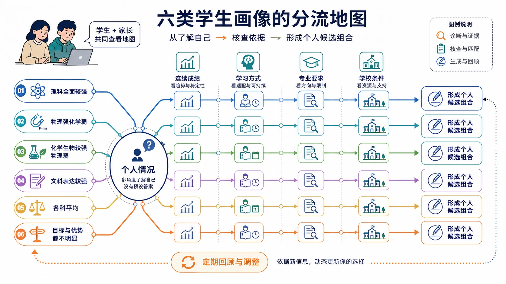
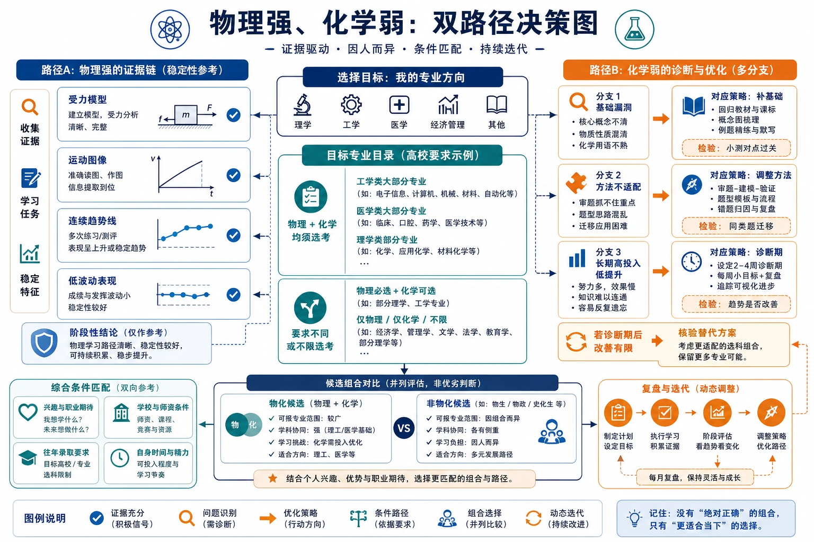
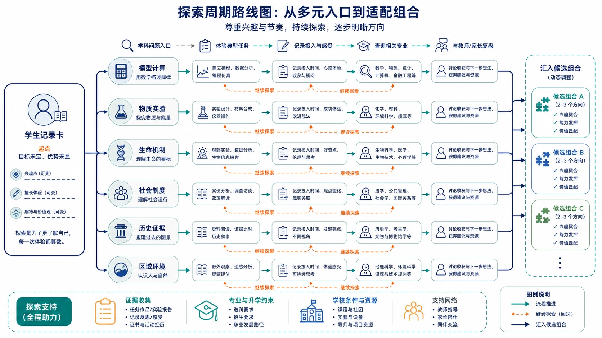

# 21 不同类型学生的选科建议

“我和别人情况差不多，他选物化生，我是不是也应该选？”

这是选科阶段非常常见的问题。学生会寻找和自己相似的同学、学长或网络案例，家长也会试图从“理科生”“偏文科”“各科均衡”这些标签里找到答案。

但画像只能帮助你提出问题，不能直接替你选组合。两个学生都说自己“物理不错”，可能一个是连续排名稳定、投入合理，另一个是只在熟悉章节得分；两个学生都说“喜欢生物”，可能一个愿意分析实验和遗传推理，另一个只是喜欢课堂故事。标签相同，证据结构可能完全不同。

> **先说结论：** 识别自己属于哪类学生，只是选科决策的起点。每一类画像都要继续核对四件事：真实成绩与相对位置、核心学习任务是否匹配、目标专业要求、学校开班与教学条件。本文的“建议”是核查重点，不是固定组合答案。

> **双读者提醒：** 学生可以用画像理解自己的学习感受，家长可以用画像发现需要补充的信息。双方都不要把“你属于这一类”说成“你必须选这一组”。

<!-- 图片描述说明：文章头图，六类学生画像的分流地图。中心是一个没有预设答案的“个人情况”节点，向外分出六条等权路径：理科全面较强、物理强化学弱、化学生物较强物理弱、文科表达较强、各科平均、目标与优势都不明显。每条路径都经过同样的四个核查站：连续成绩、学习方式、专业要求、学校条件，最后回到“形成个人候选组合”而不是直接指向某个组合。学生和家长共同查看地图，所有路径颜色和面积保持平等，不使用“高低层级”“学霸/差生”标签。 -->

## 一、先把“学生类型”当作观察工具

在进入六类画像前，先做三个区分。

### 1. 分数类型不等于学习类型

一次高分只能说明一次表现，不能直接说明学习方式适配。判断“物理强”至少要看：

- 多次考试中的相对位置；
- 受力、图像、实验、综合题是否都能处理；
- 花费多少时间才能维持；
- 错题能否通过方法调整减少。

其他科目也一样。画像中的“强”“弱”“平均”，都应理解为一段时间内的综合证据。

### 2. 兴趣类型不等于专业方向

喜欢做实验，不一定等于一定要选化学或生物；喜欢历史故事，也不一定代表适合长期处理史料论证。兴趣要落到具体任务上：你是否愿意持续做这门课最核心、最容易暴露问题的部分？

### 3. 画像相似不等于条件相同

省份、年份、学校、师资、走班方式、目标院校不同，结论都会变化。尤其是专业要求，必须精确到招生省份、适用年份、院校和专业（组），不能拿别人的录取经验直接替代查询。

## 二、类型一：理科全面较强，但方向还没有定

### 典型特点

数学、物理、化学都较稳定，生物学或地理也不排斥；考试中概念、计算、实验和图表题没有明显短板。家长常说“这种情况直接选物化”，学生却可能因为专业方向未定而犹豫第三科。

### 重点判断

第一，物理和化学是否真的在长期数据中稳定，而不是只看本校某次考试。第二，学生对工程、材料、生命、环境、计算机等方向有没有初步兴趣。第三，第三科是选择生物、地理、政治、历史中的哪一门，取决于长期学习方式和专业底线，而不是“哪门听起来更搭”。

### 可以怎样比较

可以优先把包含物理、化学的组合列为研究对象，但不要直接宣布结果。再分别比较：

- 物化生：自然科学语境较连续，但三科实验和概念训练可能集中；
- 物化地：理工基础与空间综合结合，地理综合表达不能忽略；
- 物化政/史：科学推理与人文材料切换，第三科需要独立投入。

### 学生行动

把“我为什么想保留物化”写成专业或学习理由，再比较四门第三科的连续表现、投入和兴趣。不要因为“理科强”就默认所有科学方向都适合。

### 家长行动

帮助孩子查询专业目录、招生章程和学校开班情况。理科成绩好不是家长替孩子扩大目标的理由，而是给孩子更多选择空间后继续核验的基础。

## 三、类型二：物理强、化学弱

### 典型特点

物理模型、图像或计算表现稳定，化学却出现概念混淆、方程式错误、实验条件遗漏或高投入低提升。学生常问：“我想学工科，化学弱是不是必须硬选？”

### 重点判断

要把“化学弱”拆成三种情况：

1. 基础漏洞集中，补完后有明显改善；
2. 方法不适配，投入方式需要调整；
3. 长期高投入低提升，且对化学核心任务持续排斥。

前两种可以设置 6—8 周诊断期，第三种则需要认真评估继续投入的机会成本。与此同时，查询目标专业是否确实要求物理、化学均须选考，不能用“想学工科”四个字替代官方要求。

### 可能的候选结构

如果化学有清晰改善路径，可以比较物化生、物化地等包含物化的组合；如果化学长期不适合，则比较物生地、物政地、物史地等组合，并列出不选化学后具体放弃的专业样本。重点是知道损失是什么，而不是用“物理强”掩盖化学限制。

### 学生行动

完成一轮化学错因分类，记录补基础后的变化；同时列出 5—10 个真正想了解的工科、环境或计算方向专业，逐项核验要求。

### 家长行动

不要把“化学弱”说成“没有理科天赋”，也不要把“想学工科”说成“必须物化”。帮助孩子把专业愿望和学习证据放在同一张表里。

<!-- 图片描述说明：物理强、化学弱的双路径决策图。左侧是稳定的物理证据链：受力模型、运动图像、连续趋势线和低波动标记；右侧将化学问题拆成基础漏洞、方法不适配、长期高投入低提升三种分支，每个分支对应补基础、调整方法、设置诊断期或核验替代方案。中部连接目标专业目录，分出“物理化学均须选考”和“要求不同/不限”的条件路径，最终保留物化候选与非物化候选并列比较。画面不把化学弱画成失败，也不把物理强直接画成工科通行证。 -->

## 四、类型三：化学、生物学较强，物理较弱

### 典型特点

化学和生物学成绩、兴趣或实验理解较好，物理长期感觉吃力。学生可能关注医学、药学、食品、生命科学或环境方向，家庭则担心“不选物理会不会失去机会”。

### 重点判断

不能把“想学医”作为一个统一结论。临床医学、口腔医学、药学、护理、生物科学、医学技术等不同专业和院校的选考要求可能不同；必须查询目标省份和年份下的具体专业（组）。

同时，要区分物理弱的原因：是数学工具不足、模型不会建立、图像阅读困难，还是已经经历较长时间的高投入低提升？如果目标专业明确要求物理，就需要评估是否值得设置阶段性诊断，而不是凭印象决定。

### 可能的候选结构

化生政、化生史、化生地都可能成为研究对象，但第三科的选择要看政治/历史/地理的学习方式和专业底线。不要因为化生关联生命就默认三科压力低，化学和生物学的实验、概念与材料题都需要准确处理。

### 学生行动

列出目标专业清单，逐项写明是否要求物理、化学、物理与化学；再做一次物理基础诊断，确认自己是在放弃一门科目，还是在放弃一条仍可改善的学习路径。

### 家长行动

避免用“医学一定要物化”或“生物好就肯定能学医”这样的笼统说法。家长应陪孩子核验院校差异，并接受最终方案可能不是自己最初设想的组合。

## 五、类型四：文科表达能力强，但并不代表只能选政史地

### 典型特点

学生擅长阅读、材料概括、历史解释、观点表达或区域综合；政治、历史、地理成绩相对稳定。但“文科表达强”有时只是家长对计算薄弱的另一种说法，仍需看学生是否真正适合三门科目的核心任务。

### 重点判断

政治需要理论框架和规范论证，历史需要时空与史料解释，地理需要空间过程和自然、人文综合。三科都不是只靠背诵。与此同时，经济管理、法学、新闻传播、教育、公共管理等方向也可能涉及不同的专业要求，不能用“文科专业”四个字概括。

### 可能的候选结构

政史地可以作为人文社会分析较集中的方案，但也可以比较政史生、政地生、物政史、物史地等更跨学科的组合。是否保留物理或化学，要回到专业目标和实际成绩，而不是回到“文理分科”的旧标签。

### 学生行动

分别做一套政治材料题、历史史料题和地理图表题的错因记录，比较自己最愿意长期改进哪类任务；同时查清目标专业的选考要求。

### 家长行动

不要把“表达能力强”直接等同于“理科没有机会”。如果孩子对技术、环境、数据或经管交叉方向感兴趣，应帮助其查具体专业，而不是先替孩子划定文科边界。

## 六、类型五：各科成绩平均，没有明显优势

### 典型特点

六科分数相差不大，学生觉得“哪一门都可以”，也因此最难做决定。平均不代表没有优势，可能只是各科都处于尚未拉开差距的阶段。

### 重点判断

此时不要只比较卷面分，应比较：

- 哪些科目相对排名更稳定；
- 哪些科目单位时间提升更快；
- 哪些科目的错因更容易修复；
- 哪些学习任务学生愿意持续处理；
- 哪些组合能保留真正关心的专业方向。

可以把每门科目放入“表现—投入—兴趣—专业”四格表中，先找出两门最值得继续观察的科目，再组合第三门，而不是一次把六门全部排完。

### 可能的候选结构

成绩平均的学生更需要保留 2—3 个结构不同的候选。例如，一个组合优先专业空间，一个优先学习稳定性，一个兼顾学校条件。候选之间的差异越清楚，后续观察越有价值。

### 学生行动

用 8—12 周记录拉开差距，不追求每周都提高分数，而是记录学习效率、错误修复和持续意愿。

### 家长行动

不要因为孩子“没有短板”就催着立刻确定，也不要用“分数都一样，随便选”结束讨论。平均型学生最需要的是时间结构和证据积累。

## 七、类型六：没有明确目标，也没有明显优势

### 典型特点

学生不知道想学什么，六科也没有明显稳定优势，常常受同学、家长或网络榜单影响。这不是“没有希望”，而是决策信息尚未收集完整。

### 重点判断

第一步不是逼自己立刻确定职业，而是扩大对专业大类和学习方式的认识。可以从“愿意长期处理什么问题”入手：模型与计算、物质与实验、生命与健康、社会与制度、时空与证据、区域与环境。

第二步是延长观察，建立真实数据。没有目标时，更不能用“覆盖率最高”代替方向，因为覆盖率不能告诉你是否愿意学、是否能学好。

### 可能的候选结构

先排除学校无法开设、专业底线明显不匹配和长期高投入低提升的组合，再保留 2—3 个学习方式不同的方案。每个方案配一项探索任务：读一份专业培养方案、体验一组典型题、访谈一位任课教师或完成一次大学专业查询。

### 学生行动

给自己设一个明确的探索周期，例如 6 周。每周完成一次专业或学科任务，并写下“我愿不愿意继续、我遇到的困难是什么、我想进一步查什么”。

### 家长行动

把“你怎么还没想好”换成“这周我们一起查哪个问题”。目标暂时不清楚时，家庭最重要的是保护探索空间，同时设定时间节点，避免无限拖延。

<!-- 图片描述说明：无明确目标学生的探索周期路线图。起点是“目标未定、优势未显”的学生记录卡，向外分出六种学科问题入口：模型计算、物质实验、生命机制、社会制度、历史证据、区域环境；每条路径都经过体验典型任务、记录投入与感受、查询相关专业、与教师/家长复盘四个阶段，最后汇入两到三个候选组合。路径上保留“继续探索”的回环箭头，不画迷路、落后或被迫跟风的焦虑场景。 -->

## 八、六类画像之外，还要看三个交叉变量

无论你最接近哪一类，都要额外检查三个变量。

### 1. 数学基础

数学会影响物理，也会影响部分化学计算、地理图表和经济管理相关学习。数学基础不是决定所有选科的门槛，但应成为评估投入的重要变量。

### 2. 学校条件

同一个组合在不同学校的走班、师资和课表安排可能不同。纸面上适合，不等于现实中一定能顺利学习。

### 3. 家庭期待

家庭希望和学生意愿可以不同。差异本身不是问题，问题是把家庭期待伪装成“唯一正确答案”。把双方理由写出来，再用专业要求和学习数据共同核验，往往比争论谁更懂更有效。

## 九、读完画像后，完成一次“相似与不同”复盘

可以使用[选科前自我评估表](../09-实用工具与附录/01-选科前自我评估表.md)，完成以下三句话：

1. **我最像哪一类学生？** 只选一个最接近的，不必追求完全符合。
2. **我和这类学生最不同的三点是什么？** 例如专业目标、学校条件、某科投入不同。
3. **这些不同会改变哪一个判断？** 是改变候选组合、权重，还是只需要继续观察？

如果只能回答第一句，说明你还停留在标签阶段；完成后三句，才真正进入个体化决策。

## 结语：画像是镜子，不是判决书

“理科强”“物理弱”“文科好”“各科平均”都只是暂时的描述，不是对未来的宣判。好的选科建议不会把学生塞进一个固定模板，而是帮助学生看见自己的证据、机会、代价和下一步行动。

学生要保留对自身感受的解释权，家长要帮助核验信息和创造稳定讨论环境。最终组合可以相同，也可以不同；重要的是每个人都能说清楚：我为什么这样选，放弃了什么，接下来准备怎样把它学好。

**版本说明：** 本文用于提供个体化选科的分析框架。具体科目要求、招生计划和学校安排，以所在省份当年官方信息为准。
