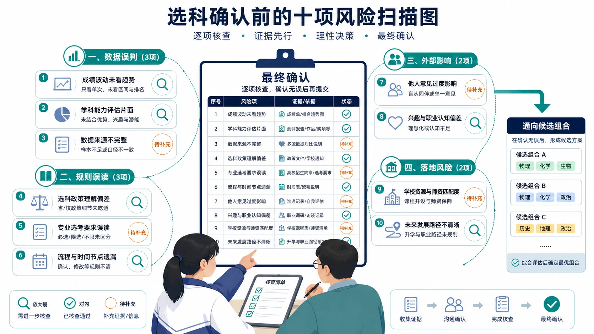
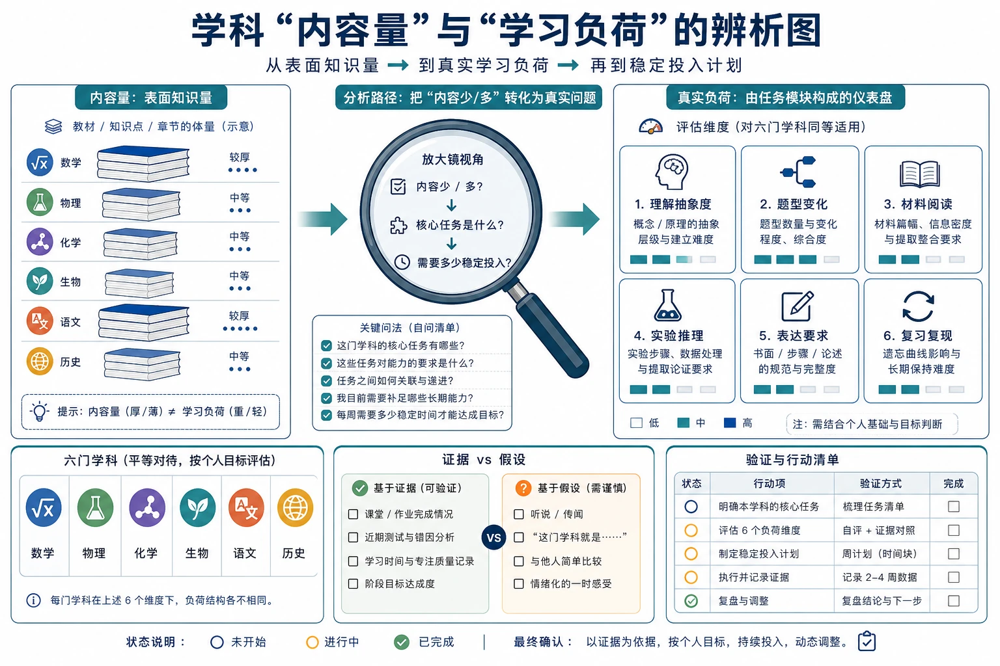
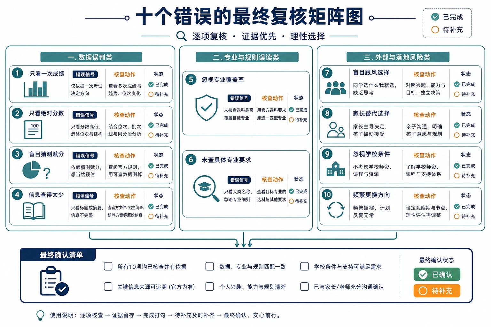

# 22 选科最容易犯的十个错误

选科真正让人后悔的，往往不是某一门科目本身，而是确认之前少查了一项信息、误读了一条规则，或者把别人的经验当成了自己的答案。

学生可能因为一次考试失常就否定一门课，也可能因为同学都选某个组合而不愿独自比较；家长则可能把专业覆盖率、网络排名或自己的成长经验，当成替孩子做决定的理由。等到选科提交后，才发现学校没有开班、目标专业要求不同，或者三门科目的学习负荷超出预期。

> **先说结论：** 选科失误大多来自信息不完整和单一因素决策。确认前请逐项检查本文十个错误，并把“已经核验”和“仍需补充”分开记录。避开错误不能保证得到所谓的最优组合，但可以显著减少因为草率、误读和跟风造成的可预见风险。

> **双读者提醒：** 学生负责表达真实感受和长期意愿，家长负责帮助查证规则、专业与学校条件。任何一方都不应把“我已经决定了”当作沟通的终点。

<!-- 图片描述说明：文章头图，选科确认前的十项风险扫描图。画面中心是一张“最终确认”表，周围环绕十个风险图标并按三组排列：数据误判、规则误读、外部影响与落地风险。每个风险图标旁有放大镜、对勾或待补充标记，学生与家长共同逐项核查；右侧保留一条通向候选组合的清晰路线。整体是理性、可执行的教育清单风格，不使用警报爆炸、失败人物、倒计时或“选错人生毁掉”的焦虑化场景。 -->

## 一、错误一：只看一次考试成绩

### 错误表现

一次考试后，学生说“物理这次考低了，我肯定不适合”，或者“历史这次最高，当然就选历史”。家长也可能根据一次成绩迅速改变原来的判断。

### 为什么容易犯

分数是最容易获得的信息，也最有即时冲击力。成绩单上一个数字清楚、直接，连续表现、错因结构和投入效率却需要花时间整理。

### 可能后果

一次试卷难度、题型覆盖、身体状态或临场失误，都可能被误读为学科能力。学生可能过早放弃正在改善的科目，也可能把熟悉章节带来的高分误判成稳定优势。

### 正确处理

至少看 8—12 周的连续记录：成绩与相对位置、主要错因、实际投入、订正效果和面对困难的意愿。遇到明显波动，先问“发生了什么”，再问“这门科目是否适合”。

### 一个小案例

小林物理一次测评失常，后来发现失分集中在刚开始学习的图像题。经过两周针对性训练，下一次测评恢复到原有相对位置。这个结果说明那次低分是一个需要修复的问题，不是立即排除物理的理由。

## 二、错误二：只看绝对分数，不看相对位置

### 错误表现

“化学 82 分，比地理 78 分高，所以化学一定更适合。”这种判断忽略了考试难度、班级环境、科目群体和个人长期位置。

### 为什么容易犯

绝对分数看起来可以直接比较，但不同科目的试卷结构和分数分布未必相同。新高考选考还可能涉及等级赋分，不能把不同科目卷面分简单横向排序。

### 可能后果

学生可能选择“分数看起来高”的科目，却忽视自己在该科目中的相对竞争力；也可能放弃卷面分较低、但长期排名稳定且提升效率更高的科目。

### 正确处理

记录同一学习环境中的相对位置和波动，再结合达到该表现所需的时间。相对位置也不是唯一指标，必须与专业要求、兴趣和学校条件一起看。

### 一个小案例

小周地理卷面分略低于历史，但连续三次相对排名更稳定，错题经订正后改善明显。她最终没有因为一次分数差就排除地理，而是把两门都放入候选观察。

## 三、错误三：认为选择人数多就容易赋高分

### 错误表现

“大家都选这门，竞争就分散了”“选的人少，高手少，更容易赋高分”。这类说法在家庭群和网络讨论中非常常见。

### 为什么容易犯

赋分规则较复杂，考生结构和相对位置也难以提前预测。人们容易用“人数多/少”这个简单变量，替代对本省规则的理解。

### 可能后果

学生为了一个无法验证的赋分猜测，放弃真正适合或专业需要的科目。即使短期“押中”了人数变化，也无法弥补长期学习不匹配带来的损失。

### 正确处理

先读懂本省等级赋分规则，再看自己的长期相对位置和学习稳定性。把“赋分猜测”降为参考因素，不能让它凌驾于专业底线和学科适配之上。

### 一个小案例

某家长根据网上帖子建议孩子选择小众科目，却没有核对本省具体规则。后来孩子发现该科目核心题型并不适合自己，家庭只好重新回到成绩记录和专业要求上讨论。

## 四、错误四：认为内容少就是容易

### 错误表现

“这门课背的内容少，应该更轻松”“那门课知识点多，肯定不能选”。学生把教材篇幅、知识点数量或网络上的“轻松科目”标签，当成难度结论。

### 为什么容易犯

学习难度不仅由知识量决定，还与抽象程度、题型变化、材料长度、实验推理、表达要求和个人基础有关。

### 可能后果

学生选了看似内容少的科目，却发现材料题、综合题和准确表达需要大量训练；也可能因为害怕知识点多，错过自己理解力强、长期表现稳定的科目。

### 正确处理

把每门科目的核心任务写出来：物理是否需要建模计算，化学是否要在三层语言间切换，生物是否要读图实验，政治历史是否要材料论证，地理是否要空间过程与综合表达。比较任务，不比较传言。

<!-- 图片描述说明：学科“内容量”与“学习负荷”的辨析图。左侧用厚薄不同的教材堆表示表面知识量，右侧用多个任务模块组成真实负荷仪表：理解抽象度、题型变化、材料阅读、实验推理、表达要求、复习复现。中间用放大镜把“内容少/多”转化为“核心任务是什么、需要多少稳定投入”的分析路径；六门科目以平等图标呈现，不对任何科目贴简单难易标签，不出现轻松榜或高压榜。 -->

## 五、错误五：只看专业覆盖率

### 错误表现

“这个组合覆盖率最高，所以一定最好”“覆盖率低的组合没有未来”。家庭只看一个百分比，不看学生真正关心哪些专业。

### 为什么容易犯

百分比具有权威感和可比较性，但统计年份、省份、院校范围、专业口径和是否按专业（组）统计，都可能不同。更重要的是，个人不会平均报考所有专业。

### 可能后果

学生为了保留大量自己不考虑的方向，承担更高学习压力；或者因为一个泛化数字放弃真正感兴趣、且选科要求允许的路径。

### 正确处理

建立个人目标清单，逐项核验“省份—年份—院校—专业（组）—选考要求”。把专业分为必须保留、可以接受、暂不考虑三层，计算自己的匹配情况，而不是迷信全网覆盖率。

### 一个小案例

小陈原本想学环境相关方向，却因网上“覆盖率”文章选择了自己并不擅长的组合。后来她逐校查询，发现几个真正关注的专业要求并不完全一致，于是重新比较学习适配与专业底线，方案更加清晰。

## 六、错误六：跟随同学选择

### 错误表现

“我们班大多数人都选物化，我也不想落单”“朋友选政史地，我们一起上课更有伴”。同伴关系被误当成选科依据。

### 为什么容易犯

选科会影响走班和日常学习，学生自然希望和熟悉的人在一起。群体选择还能暂时减轻不确定感，让人感觉“大家一起承担就不会错”。

### 可能后果

同学的成绩结构、专业目标、家庭条件和学习节奏与你不同。跟随之后，既没有获得真正的适配，也可能失去自己原本更合理的候选方案。

### 正确处理

可以把同伴意见当作信息来源，不能当作结论。问清对方为什么选、依据是什么，再把这些理由放回自己的数据和专业清单中核验。

### 一个小案例

小赵和好友都喜欢地理，但好友目标是师范方向，小赵更关注计算机和环境。两人最后没有选择完全相同的组合，却仍然可以在学习方法和资料整理上互相帮助。

## 七、错误七：完全听从家长决定

### 错误表现

家长说“我见得多，替你选”，学生说“反正最后听父母的”。表面上减少了争论，实际上可能把学生从决策中排除。

### 为什么容易犯

家长通常更擅长查资料、比较风险，也更容易受到职业、收入和社会评价的影响。学生则可能因为信息不足而放弃表达。

### 可能后果

选科提交后，学生对组合缺乏解释和投入意愿；一旦成绩波动，家庭容易把责任互相推给对方。家长的经验也可能与当前政策、专业要求和学校安排不完全相同。

### 正确处理

采用“学生先说、家长补充、共同核验”的顺序。学生先讲学习感受、愿意保留的方向和可承受投入；家长再补充专业、政策和学校信息；最后共同写出候选、代价与备选。

### 一个小案例

小彤的家长希望她选择所谓“专业范围广”的组合，但小彤更擅长另一种学习方式。家庭把双方理由写进评分表后发现，争议其实来自对目标专业和学习投入的理解不同，沟通因此从争执变成核验。

## 八、错误八：忽视学校师资和开班情况

### 错误表现

网上看起来可以选择的组合，学生提交前才发现学校不开设、人数不足、走班课表冲突，或者某科由临时教师承担。

### 为什么容易犯

家庭容易把政策允许等同于学校一定提供。学校条件往往属于本地信息，不会出现在通用组合文章里。

### 可能后果

组合被迫调整，原本的专业规划和学习节奏同时受到影响；即使勉强开班，课程衔接和教学支持也可能低于预期。

### 正确处理

向班主任、年级组或教务部门确认：候选组合是否开设、预计人数、师资安排、走班方式、课表冲突、确认时间、调整条件和调整后如何衔接。最好保留学校公开通知或书面说明。

### 一个小案例

小岳认为某组合最适合自己，但学校通知该组合人数不足。因为他提前保留了第二候选，并核对了第二候选的专业要求，调整时没有重新从零开始。

## 九、错误九：不查询具体院校专业要求

### 错误表现

“计算机都要求物化”“医学都必须选物化”“师范专业不限科目”。这些表述把大类印象当成具体招生规则。

### 为什么容易犯

专业名称容易记，官方目录和招生章程需要逐条核对；网络文章也常把不同年份、不同省份的要求混在一起。

### 可能后果

学生错失原本可报的方向，或者以为满足了资格却在具体专业（组）上不符合要求。资格、学习衔接、招生计划是三个不同问题，不能混为一谈。

### 正确处理

每个目标方向至少记录来源、招生省份、适用年份、院校、专业（组）、选考要求、当年计划和查询日期。信息不完整时标记“待核验”，不要直接转发截图或作结论。

### 一个小案例

小安想学环境相关专业，最初只看了一个网络表格。进一步查到不同院校的要求并不完全相同后，她把目标拆成三个具体专业（组），组合比较因此从“环境专业能不能报”变成“哪些目标可以保留”。

## 十、错误十：选科后频繁更换

### 错误表现

一次考试后想换科，看到同学成绩好想换科，听到一个新传言又想换科。学生在多个组合之间反复摇摆，学习时间被调整本身消耗。

### 为什么容易犯

确认后的前一段时间本来就会经历新课适应、知识断层和成绩波动。家庭如果没有事先约定观察周期，就容易把短期不适当成最终结论。

### 可能后果

知识衔接断裂，原科目和新科目都没有形成稳定基础；学校的调整截止时间、课表和考务安排也可能不允许频繁更换。

### 正确处理

在允许调整的前提下，先设定一个明确诊断周期，记录问题、尝试方法和变化，再决定是否调整。只有出现专业底线重大变化、学校无法开班、长期高投入低提升等结构性问题，才值得启动正式调整流程。

### 一个小案例

小菲选科后第一次测评下降，原本想立即更换。班主任建议她先完成四周错因记录，结果发现主要问题是新题型不熟而非科目不适合。她调整了学习方法，没有因为短期波动反复换科。

<!-- 图片描述说明：十个错误的最终复核矩阵图。画面将十项错误按三组分区：数据误判包含一次成绩、绝对分数、赋分猜测、内容少等；专业与规则误读包含覆盖率和未查具体专业；外部与落地风险包含跟风、家长替选、忽视学校条件、频繁更换。每个格子同时放“错误信号—核查动作—已完成/待补充”三个信息位，最后汇入一张最终确认清单；版式强调逐项复核，不使用大红叉堆叠或制造恐慌。 -->

## 十一、提交前的最终确认流程

把十个错误看完后，不要只在心里说“我不会犯”。建议按下面四步完成书面确认。

### 第一步：标记信息状态

对每项写“已核验”“部分核验”或“待补充”。“我听老师说过”不等于已核验；能写出来源、年份和查询日期，才算完成一项信息核对。

### 第二步：让学生独立复述

学生用自己的话说清楚：我选择的候选组合是什么、它保留哪些方向、主要代价是什么、如果遇到风险准备怎么办。如果只能复述家长或网络原话，说明理解还不够。

### 第三步：做一次反向检查

问四个问题：

- 如果最高分组合不能开班，第二方案是什么？
- 如果目标专业要求发生变化，哪些方向会受影响？
- 如果某科成绩短期下降，观察多久再判断？
- 如果最终成绩低于预期，这个组合是否仍有可接受路径？

### 第四步：记录最终决定与未决事项

决定记录不必写得复杂，但至少包含：日期、招生省份与年份、候选组合、最终选择、主要依据、主要代价、备用方案、仍需关注的政策或学校信息。可以参考[选科最终确认清单](../09-实用工具与附录/06-选科最终确认清单.md)逐项完成。

## 十二、家长和学生的“最后一次对话”可以这样进行

**学生先说：** “我选择这个组合，是因为……我最担心……我准备这样应对……”

**家长再说：** “我查到的专业和学校信息是……我仍然担心……我愿意帮助你完成……”

**双方共同确认：** “我们知道这个选择不能保留所有方向，也知道如果出现某种变化，下一步应该查什么、和谁沟通、在什么时间内处理。”

这段对话的目标不是让双方意见完全一致，而是确保学生理解选择、家长理解代价、家庭知道行动路径。

## 结语：避开错误，是为了更清醒地承担选择

选科不是一场只要避开十个坑就能拿到满分的考试。每个学生都要在专业机会、学科适配、成绩稳定、学习投入和学校条件之间做取舍。

把错误逐项排查的价值，是让取舍变得清楚：哪些信息已经确认，哪些只是猜测；哪些机会是自己真正重视的，哪些只是看起来很大；哪些风险可以通过行动降低，哪些代价需要坦然接受。

当学生能够解释自己的决定，家长能够说清信息来源，家庭也准备好了变化后的备选方案，选科就不再只是一次匆忙勾选，而是一份经过共同核验的成长记录。

**版本说明：** 本文用于选科确认前的风险排查。具体政策、专业要求、招生计划和学校安排，以所在省份当年官方信息为准。
