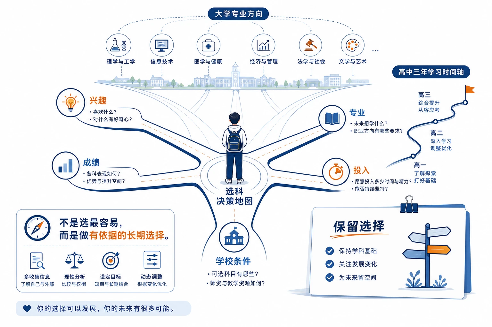
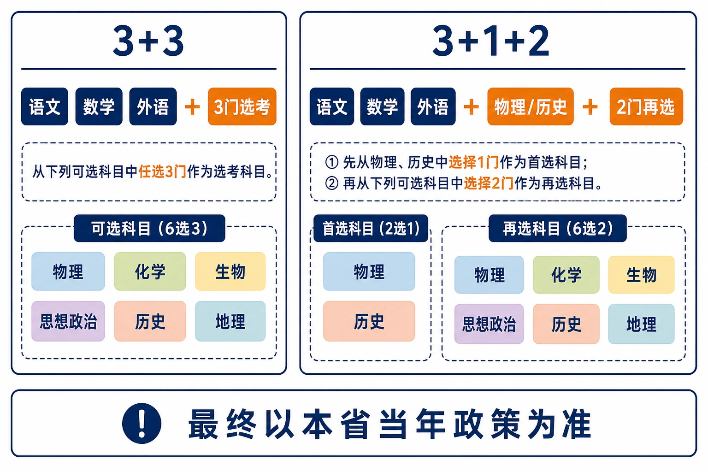
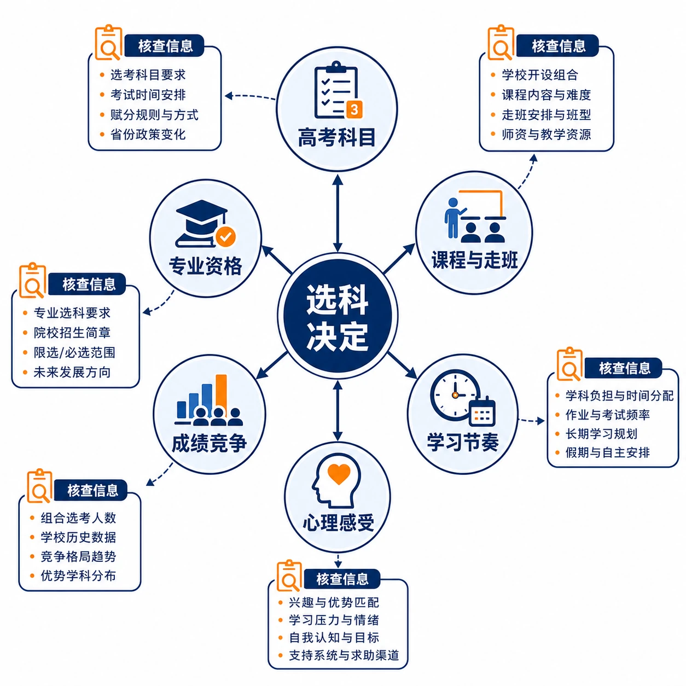
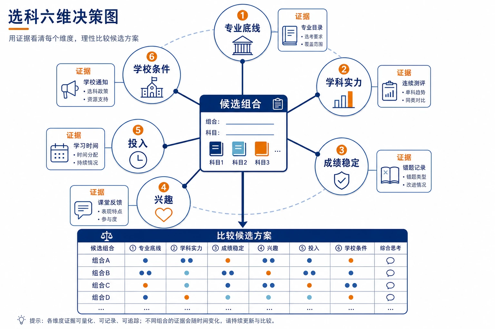
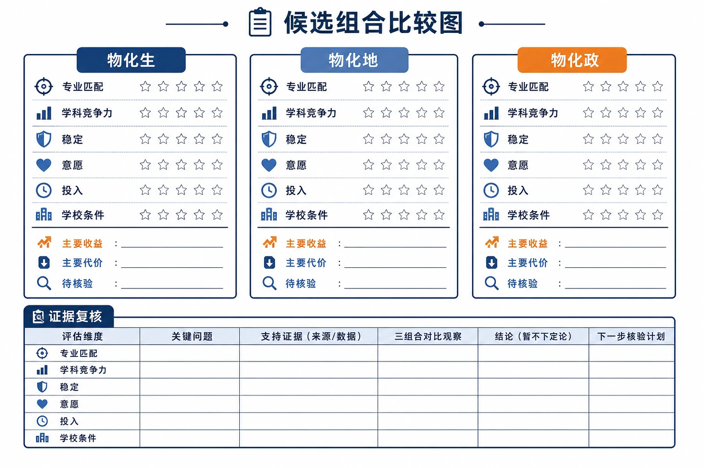

# 高中选科指南：不是选“容易”，而是为未来保留选择

> **写给高一学生和家长：选科不是一次简单的三选三，而是一次关于专业入口、学习优势与三年节奏的共同决策。**

很多同学刚进入高中，会把选科理解成一句话：

> “哪三科容易学，我就选哪三科。”

这句话只对了一小半。

容易上手、成绩稳定，当然重要；但选科更像是在给未来的大学专业“配钥匙”。有的钥匙能打开很多扇门，有的钥匙只适合少数方向。真正理想的选择，不是别人眼里的“黄金组合”，而是**既不堵住你想走的路，又能让你三年持续学得好** 的组合。

<!-- 图片描述：文章头图。画面中心是一张“高中选科决策地图”，学生站在“兴趣、成绩、专业、学习投入、学校条件”五条路径交汇处，远处连接大学专业方向和高中三年学习时间轴；旁边放着一张写有“保留选择”的简洁卡片。整体为浅色教材信息图风格，白底、深蓝线条、橙色重点标记，突出“不是选最容易，而是做有依据的长期选择”；不出现“黄金组合”“选错人生毁掉”或保证录取等焦虑化文字。 -->

---

## 一、先弄明白：新高考到底怎么选

不同省份的模式并不完全相同，不能拿别人的组合直接套在自己身上。目前常见的有两类。

### 1. “3+3”模式：六选三

语文、数学、外语为必考科目；再从物理、化学、生物、思想政治、历史、地理中自主选择 3 门。

这种模式下，理论上共有 $C_6^3=20$ 种组合。例如北京采用这一模式。

### 2. “3+1+2”模式：先选物理或历史，再选两门

- “3”：语文、数学、外语，所有学生必考；
- “1”：物理、历史二选一，称为首选科目；
- “2”：化学、生物、思想政治、地理四选二，称为再选科目。

这种模式理论上有 12 种组合。物理或历史不是普通的“六科之一”，而是先决定了一个重要方向。

无论你所在省份采用哪种模式，都先记住一句话：

> **选科规则看本省，专业要求看“学校 + 专业”，最终以高考当年公布的信息为准。**

另外，选科也不意味着其他课从此彻底不学。各地高中仍会按课程方案安排课程和合格性考试；真正计入选择性考试成绩的科目、成绩呈现方式和选科确认时间，则要以本省政策与学校通知为准。

<!-- 图片描述：新高考选科规则对比图。画面左右并列呈现“3+3”和“3+1+2”两种结构：左侧用语文、数学、外语三个固定节点连接六选三环形选择区；右侧先用物理/历史二选一的首选节点，再连接化学、生物、思想政治、地理四选二的再选节点。底部用醒目的核验框标注“规则看本省、要求看学校与专业、最终以当年官方信息为准”。使用清晰的数字、箭头和分组，不写具体省份结论，不把任何组合标为最佳。 -->

---

## 二、为什么选科要认真：它会影响三件大事

### 1. 它决定你有哪些专业可以报

高校会根据专业培养需要提出选考要求。有些专业不限选科，有些要求一门，有些则要求两门甚至三门“均须选考”。同一个专业名称，在不同学校的要求也可能不同。

举几个常见方向：

- 计算机、电子信息、自动化、材料、化工、土木等理工类专业，常见物理或“物理 + 化学”要求；
- 医学、药学、生命科学等方向，常需重点核查物理、化学、生物的组合要求；
- 思想政治教育、马克思主义理论等方向，常会关注政治；
- 汉语言、历史、哲学、新闻传播等人文社科方向，历史、政治、地理往往更有相关性；
- 经济、金融、管理类专业并非一律不限选科，部分学校同样会提出物理或其他要求。

所以，选科的第一问不该是“哪科卷子简单”，而应是：

> **我想读的专业，需要我拿着哪几把钥匙去敲门？**

### 2. 它影响你的竞争方式

在许多新高考地区，部分选考科目会采用等级转换或等级赋分。它考察的不只是卷面分数，还与你在同一选考群体中的相对位置有关；但具体哪些科目按原始分、哪些科目等级转换，各省规定并不相同。

因此，别只问“这科容易不容易”，还要看：

- 这门课是不是你的稳定优势；
- 同样投入时间，你的提升是否明显；
- 面对综合题和难题时，你能否保持相对竞争力；
- 你的选择是否建立在长期数据上，而不是一次考试的偶然发挥。

### 3. 它塑造高中三年的学习方式

不同学科的日常训练差异很大：

| 科目 | 核心学习体验 |
|---|---|
| 物理 | 模型、推理、计算、实验分析 |
| 化学 | 概念网络、实验规律、计算与细节辨析 |
| 生物 | 记忆理解、图表信息、实验设计与逻辑判断 |
| 政治 | 理论框架、时事材料、规范表达 |
| 历史 | 时间线、因果解释、史料阅读与论证 |
| 地理 | 地图与空间分析、自然规律、数据与综合表达 |

真正的“适合”，不是某节课觉得有趣，而是当成绩下滑、题目变难时，你仍愿意去复盘、订正和积累。

<!-- 图片描述：选科影响关系图。中心是“选科决定”，向外连接六个带有简洁图标的模块：高考科目、课程与走班、学习节奏、专业报考资格、成绩竞争、心理感受；每个模块再用短箭头连接“需要核查的信息”。采用白底、深蓝结构线和橙色重点节点，突出选科对高中三年和大学报考的连锁影响，不使用分数排名或录取保证。 -->

---

## 三、选科前，先做这三个判断

### 第一层：专业门槛——先别把路堵上

请先列出三张清单：

1. **最想读的方向**：即使现在只有一两个，也写下来；
2. **可以接受的方向**：作为未来的备选；
3. **明确不想读的方向**：帮你排除不必要的顾虑。

然后到本省教育考试院网站、目标高校招生网，查询这些方向的选考要求。不要只查一个学校，也不要只看专业名称；至少各找几所“冲一冲、合适、保底”的学校作对照。

如果你暂时没有明确专业方向，最稳妥的思路不是立刻追求最轻松，而是：

> **在自己能够学好的前提下，尽量保留未来可能会用到的关键科目。**

对不少理工医方向来说，物理和化学往往是需要重点核查的关键组合；但这不是“所有人都必须选物化”。如果这两科长期明显吃力、投入和产出严重失衡，也应结合目标专业认真评估，而不是硬撑。

### 第二层：学科实力——看趋势，不看一次成绩

建议至少收集 3—5 次较有代表性的考试数据，观察：

- 年级或班级相对位置；
- 成绩波动幅度；
- 同样投入时间后的提升速度；
- 错题是粗心、知识漏洞，还是思维方式不匹配；
- 遇到难度提升后，能否通过训练追上来。

一个非常实用的问题是：

> **同样给两小时，哪门学科最值得我投入？**

一次考高，可能是题目恰好对胃口；连续几个阶段都稳定，才更接近真实优势。

### 第三层：可持续性——你能不能和它相处三年

给自己四个诚实的问题：

1. 我愿意连续三年学习这门课吗？
2. 它需要的思维方式，与我相匹配吗？
3. 成绩暂时下降时，我还愿意继续钻研吗？
4. 本校的师资、班型、走班安排能否支持我学好它？

兴趣、能力和现实条件，缺一不可。只凭“喜欢”而忽略能力，或只凭“分高”而忽略长期意愿，都容易让高二、高三变得被动。

<!-- 图片描述：选科六维决策图。中心放置“候选组合”卡片，周围环绕六个等权维度：专业底线、学科实力、成绩稳定、兴趣与学习意愿、学习投入、学校条件；每个维度旁用小型证据卡表示“专业目录、连续测评、错题记录、学习时间、课堂反馈、学校通知”。所有维度最终汇入“比较候选方案”而非固定答案，整体为浅色教材流程图风格，不使用“学霸/差生”或简单难易标签。 -->

---

## 四、常见组合怎么理解：先看方向，再看适配

组合不是标签，更不是排名。下面的理解方式，比“最强组合”“最稳组合”更有用。

### 物理 + 化学 + 一门优势科目

这类选择通常更适合希望保留较多理工、工科、医学相关可能性的同学。

- **物化生**：学习结构相对集中，适合对生命科学、医学、化学或传统理科方向有兴趣，且理科基础较均衡的学生；
- **物化地**：适合物化优势明显，又擅长空间分析、图表和综合表达的学生；
- **物化政**：适合逻辑计算与阅读表达都较均衡，希望兼顾理工与公共事务、法律等方向的学生。

它们的共同点是专业选择面往往较宽，但任务量也不轻。不要因为“覆盖广”就忽视自己的学习承受力。

### 物理 + 生物 / 地理 / 政治等组合

这类组合保留了物理方向，但如果不选化学，部分理工、医学和生命科学专业的报考资格可能受到影响。是否适合，关键不在于“化学难不难”，而在于你已经查清：**你真正想去的学校和专业，会不会要求化学。**

### 历史 + 政治 + 地理

这是一种学习方式相对连贯的人文社科组合，适合阅读、材料分析、记忆整合和表达论证能力较强，并且明确倾向人文社会科学方向的学生。

它的风险也很清楚：多数理工医方向的可选范围会缩小。因此，若专业方向尚未确定，不妨先把专业目录查透，再决定是否放弃物理。

### 历史 / 政治 + 生物或地理

这类选择更强调个人优势：有些同学的生物或地理显著强于另一门传统文科，完全可以把自己的长板纳入组合。但同样要先做专业核验，别让一次看似“更好拿分”的选择，变成日后填报时的限制。

---

## 五、一张表，帮你把“感觉”变成选择

把你正在纠结的 2—3 个组合写下来，逐项打分。你不需要追求精确到小数点，重点是强迫自己同时看见“未来”和“当下”。

| 评价项 | 建议权重 | 要问自己的问题 |
|---|---:|---|
| 目标专业匹配度 | 40 分 | 是否满足想报专业的选考要求？ |
| 当前学科竞争力 | 25 分 | 我的相对排名、理解速度和解题能力如何？ |
| 成绩稳定性 | 15 分 | 多次考试后，成绩是否稳定？ |
| 兴趣与学习意愿 | 10 分 | 遇到困难时，我还愿意投入吗？ |
| 学校资源与走班安排 | 10 分 | 师资、班型和课程安排是否合适？ |

例如，你在“物化生”“物化地”“物化政”之间犹豫，就分别填三张表。这样做的价值在于：不会因为一门课一次多考 5 分，马上推翻自己对专业和长期学习的判断。

<!-- 图片描述：候选组合比较图。画面中央并列放置“物化生”“物化地”“物化政”三张候选卡片，每张卡片包含“专业匹配、学科竞争力、成绩稳定、学习意愿、投入、学校条件”六个评分槽位；卡片下方分别标注“主要收益、主要代价、待核验信息”，最终汇入一张“证据复核”表，而不是直接突出某个最高分组合。整体采用浅色表格信息图风格，数字清晰但不制造冠军榜。 -->

---

## 六、六个最容易踩的坑

### 误区 1：哪科简单就选哪科

所谓“简单”常常只是个人感受。尤其涉及等级转换的地区，真正重要的是你的相对位置，而不是别人口中的“好学”。

### 误区 2：只看高一一次考试

高一往往还处在基础学习阶段。有人物理前期一般，后来模型思维形成后提升很快；也有人前期靠记忆得分，高二综合题增加后开始波动。看趋势，比看一次名次更可靠。

### 误区 3：因为害怕难度，没查专业就放弃物理或化学

可以不选，但要在查清专业要求后再不选。对目标涉及理工、计算机、人工智能、医学等方向的同学，这一步尤其关键。

### 误区 4：盲目追求“物化组合专业覆盖广”

覆盖广不等于适合。若物理、化学长期是明显短板，投入极大仍难以改善，硬选可能拖累总分和学习状态。专业门槛与个人实力，需要一起衡量。

### 误区 5：跟着同学选

同学关系、班级氛围可以考虑，但只能排在最后。选科影响的是你的成绩、志愿和未来路径，不能把自己的长期选择交给别人的短期决定。

### 误区 6：只看专业名称，不看具体学校要求

同名专业在不同学校可能有不同选考要求；高校专业设置和招生计划也可能调整。一定查“学校 + 专业 + 本省年份”的正式目录。

---

## 七、不同情况，怎样开始判断

| 你的情况 | 可以优先考虑的方向 |
|---|---|
| 理科较强，未来专业尚不明确 | 在能力允许时，重点保留物理、化学，再从优势科目中选择 |
| 想读计算机、电子、人工智能、工程 | 首先查询目标院校是否要求物理或物理 + 化学 |
| 想读医学、药学、生命科学 | 重点核查物理、化学、生物是否有“均须选考”要求 |
| 想读法学、政治学、思政教育 | 重点核查政治要求，同时看院校具体规定 |
| 想读汉语言、历史、新闻、哲学 | 结合历史、政治、地理的优势与目标院校要求判断 |
| 想读经济、金融、管理 | 不要想当然地认为“不限科目”，应逐校逐专业核查 |
| 完全没有专业方向 | 不过早定性自己是“文科生”或“理科生”，先用成绩数据和专业查询缩小范围 |
| 数学、理科长期明显困难 | 不盲目追全理科，优先保证总成绩、学习状态与可持续性 |

---

## 八、给高一学生的行动清单

从现在开始，你只需要完成这 5 件事：

1. 记录接下来几次大考的各科成绩和年级位置；
2. 列出 3 类感兴趣或可以接受的专业方向；
3. 到本省教育考试院和目标高校招生网，查对应选考要求；
4. 保留 2—3 个候选组合，用评分表比较；
5. 与班主任、任课老师、家长沟通时，带着数据和专业目录，而不只带着“我感觉”。

教育部也明确要求高中开齐课程、开足课时，不得组织学生提前选科。对学生来说，这意味着高一不是“赶紧站队”的阶段，而是一个认真观察自己、了解大学专业、积累判断依据的阶段。

<!-- 图片描述：高一行动清单配图。画面是一张简洁的学习计划桌面，三张并列卡片分别写“记录数据”“查询专业”“确认学校”，卡片下方有日期、来源和下一步动作的小字段；右侧是一位学生把记录表交给家长和老师共同查看。整体浅色、留白充足、适合公众号文末使用，强调先观察和核验，不出现倒计时或焦虑表情。 -->

---

## 最后想说

选科没有绝对正确答案，只有更适合你的答案。

请按这个顺序做决定：

> **专业资格 → 学科实力 → 成绩稳定 → 学习意愿 → 班型与同学因素**

别把选科当作“哪三科最轻松”的投票。它更像一次提前的生涯规划：既要看眼前的分数，也要为未来留一扇门。

当你能说清“我为什么选、我因此保留了什么、我愿意为它投入什么”，你的选科就已经走在了正确的路上。

---

## 信息核验提醒

- 各省的考试模式、成绩呈现、选科确认时间和学校走班安排可能不同，请以本省教育考试院和学校通知为准。
- 高校专业的选考要求、招生计划和专业名称可能调整，请以高考当年本省公布的招生专业目录、院校招生章程为准。

### 参考信息

- [教育部：2026 年普通高校招生工作通知](https://www.moe.gov.cn/srcsite/A15/moe_776/s3258/202601/t20260121_1427110.html)
- [教育部阳光高考：什么是“3+1+2”模式](https://gaokao.chsi.com.cn/gkxx/gkcs/202203/20220315/2266235555.html)
- [教育部：2026 年全国高考专题（选考科目要求说明）](https://www.moe.gov.cn/jyb_xwfb/xw_zt/moe_357/2026/2026_zt08/)
